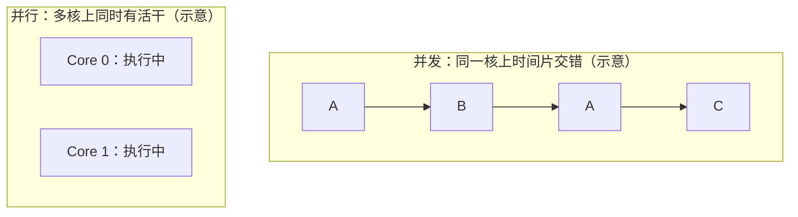
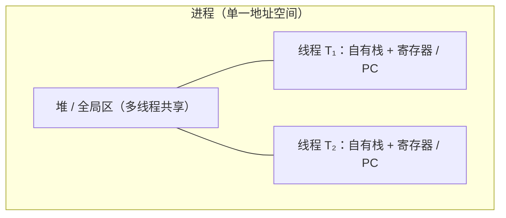
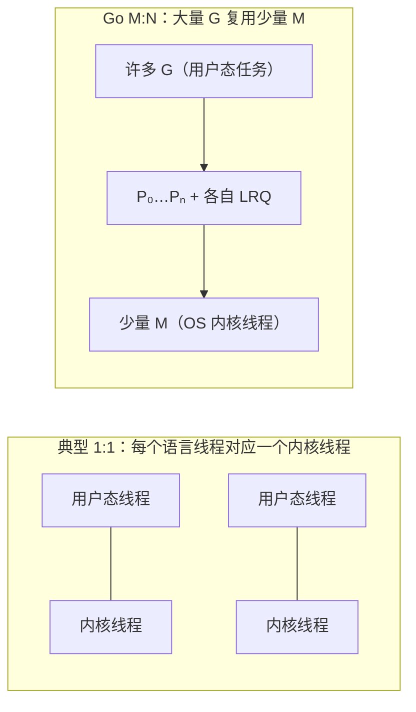
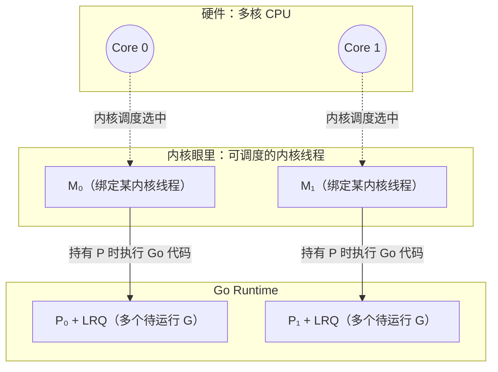
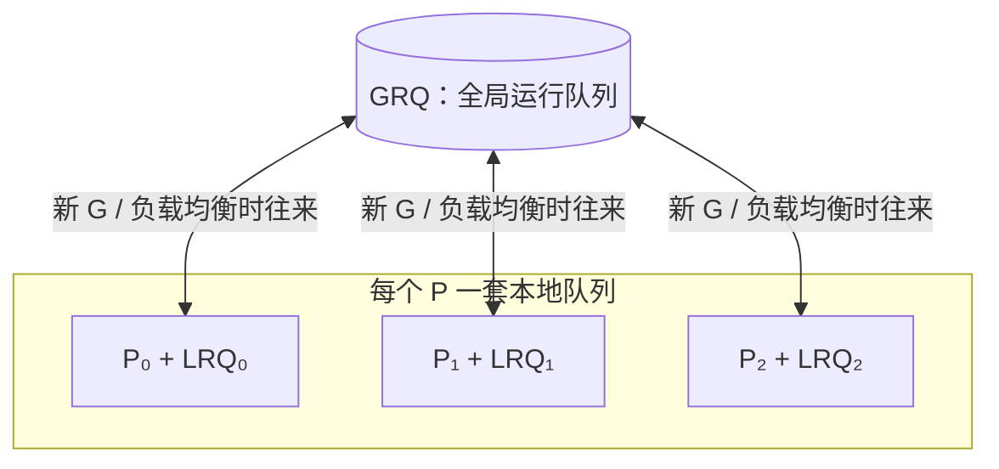
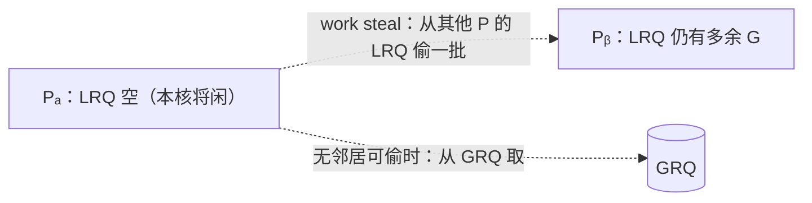
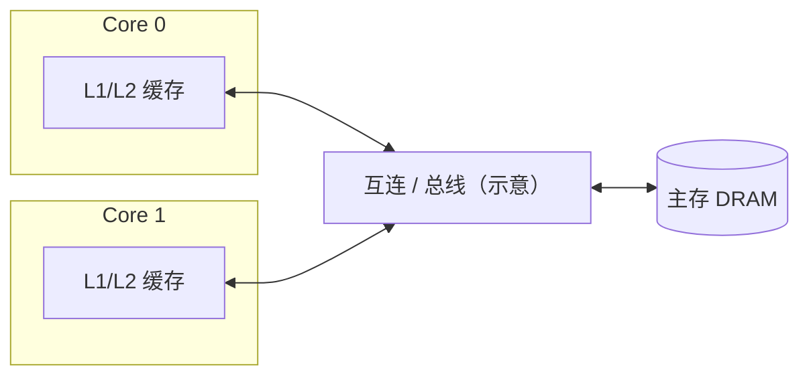
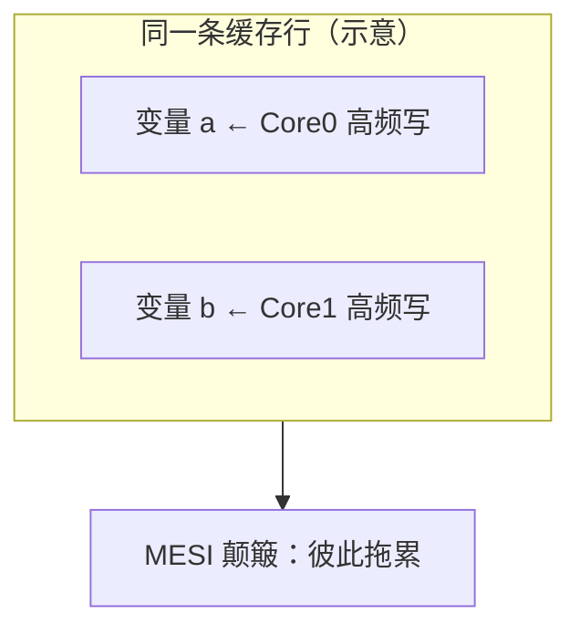
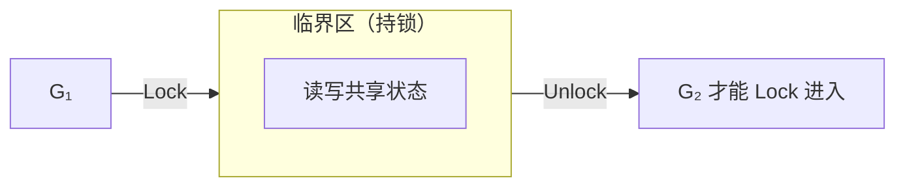
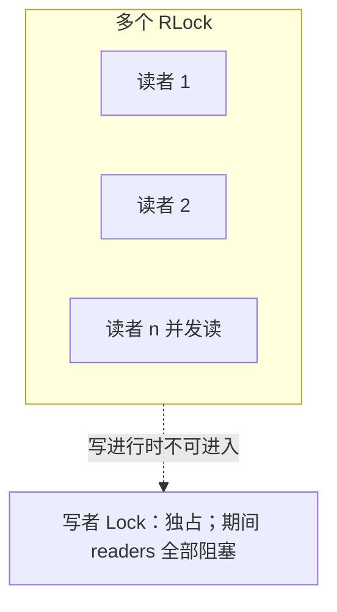

```yaml
title: Learn Concurrent Programming with Go
author: James Cutajar (Manning, 2023)
type: book
status: in-progress
tags:
  - go
  - concurrency
  - goroutines
  - channels
  - mutex
  - waitgroup
  - synchronization
  - concurrency-patterns
  - study-notes
```

### 文档说明

- **定位**：围绕 *Learn Concurrent Programming with Go*（Cutajar, Manning, 2023）整理的 **技术向速查与补充**，与 [The Go Memory Model](https://go.dev/ref/mem)、[Race Detector](https://go.dev/doc/articles/race_detector) 等 **官方材料对照阅读** 最合适；**不替代**语言规范与源码。
- **结构**：每章开头有 **「本章摘要」** 表（便于跳转与回顾），正文按主题分节展开；图与短代码用于 **建立直觉**。
- **范围**：当前正文覆盖 **Ch1–Ch4**；文末 **`cmd/`** 为可运行示例索引，需要时再打开。

---

# Chapter 1：为何用 Go 做并发 — 概念、立场与扩展直觉

**本章主线**：先统一 **并发 / 并行** 与 **单核上的并发为何成立**，再落到 **Go 的设计立场**（写对并发，并行交给 runtime）、**goroutine + 两套范式（CSP / 共享内存）**，最后用 **阿姆达尔 / 古斯塔夫森** 解释多核扩展的直觉与边界。

**本章摘要**

| 主题 | 说明 |
|------|------|
| 并发 | **时间段内交替推进**，同一瞬间未必都在跑 |
| 并行 | **同一时刻**多个算力单元上真有活干，依赖 **多核等硬件** |
| Go 立场 | 人写 **并发正确性**；**并行度与映射**交给 **runtime + CPU/OS** |
| Goroutine | **轻、多**；仍要 **限流/背压**，不是无限魔法 |
| 两套范式 | **Channel（CSP）** 通信；**Mutex 等** 守共享内存；常 **混用** |
| 阿姆达尔 | **固定题** + 有串行比例 \(B\) → 加速比 **有硬顶** \( \approx 1/B \) |
| 古斯塔夫森 | **题随算力变大**、并行段能吃满核 → **吞吐**更易随核涨 |

---

## 1. 并发是什么：时间上的交替，而非时刻上的「同时」

**Concurrent（并发）**：多个任务在时间段内**交替推进**，同一瞬间未必都在执行。

书里的目标表述可以压缩成一句：**写出健壮、可扩展的并发程序**。现代服务器普遍 **多核**，分布式与云原生又天然需要 **水平扩展**；Go 的并发原语（goroutine、channel 等）就是为这种环境准备的。

**单核上并发依然成立**：没有多核时，操作系统用 **时间片** 调度——某任务在 IO、等待、阻塞时，CPU 转去跑别的任务。此时 **微观上是串行**（同一时刻只有一个在跑），**宏观上像并行**；本质是用更好的 **排布策略** 吃掉空闲时间。

---

## 2. 并发与并行：分工不同，在 Go 里又常一起出现

|      | **并发 Concurrency**                | **并行 Parallelism**                     |
| ---- | ----------------------------------- | ---------------------------------------- |
| 侧重 | 程序结构：任务如何拆分、协作、交替  | 执行方式：是否在同一时刻占用多个算力单元 |
| 依赖 | 语言与模型（goroutine、channel 等） | **硬件多核**（或等价的多执行单元）       |
| 关系 | 单核也可有并发结构                  | 没有多核就没有「真同时」意义上的并行     |

现代机房与云主机默认多核，因此：**用 Go 写好并发结构之后，常常能自然映射成多核上的并行执行**；但「结构上并发」并不自动等于「始终算对」，正确性仍要自己保证。



---

## 3. 设计立场：先写对并发，并行交给 Runtime 与硬件

> We should focus mainly on writing correct concurrent programs, letting  
> Go's runtime and hardware mechanics deal with parallelism.

开发者优先保证 **并发逻辑正确**（同步、通信、不变量、无数据竞争）；**多核上谁跑哪段、如何映射到线程、如何占满算力**，主要由 **Go runtime** 与 **CPU / OS 调度** 承担。这与「自己绑线程、自己算并行度」的传统负担形成对比。

**与传统 OS 线程模型对照**：传统路径里开发者往往要直面线程生命周期、栈与配额、调度与切换成本、线程间通信；线程 **重**，数量必须 **严控**。Go 则把大量「轻量并发单元」交给 runtime 管理（第二章展开 **G / P / M**）。

---

## 4. Goroutine：轻量、按需创建，但不是「无限魔法」

需要多少逻辑并发，就起多少 **goroutine**，不必像线程池那样为「线程个数」过度焦虑；**栈、调度、与内核线程的映射**由 runtime 处理。

仍会有人问：**goroutine 要不要设上限？** 相对传统线程，Go 通过轻量抽象与调度把 **数量硬约束** 大大放宽；但 **内存与调度压力** 仍在，无节制创建会导致堆积与延迟抖动——**业务上仍要有背压、池化或限流等策略**，只是动机从「线程太贵」扩展为「资源与可观测性」。

---

## 5. 两套并发范式：CSP（channel）与共享内存（锁等）

Go 提供基于 **CSP** 的抽象：**通过 `channel` 通信** 来协作，思维上贴近「谁把消息交给谁」，有助于减少共享可变状态上的竞态。

**CSP 不是银弹**：简单的临界区、计数器、缓存结构，用 **mutex、WaitGroup、条件变量** 等往往更直接。实践上常见组合：**能用通信表达清楚的用 channel；必须保护共享内存的用锁**，二者互补。

**代码对照（语义以内存模型为准）** — 用 channel 表达「做完再往下走」（`close` / 接收配合；生产代码常还带 `context` 取消）：

```go
package main

func main() {
	done := make(chan struct{})
	go func() {
		// ... 一段并发任务 ...
		close(done)
	}()
	<-done // 等待 goroutine 发出「完成」信号
}
```

同一逻辑若共享 `int` 计数，用 **mutex** 保护 **读改写**：

```go
package main

import "sync"

func main() {
	var mu sync.Mutex
	var counter int
	mu.Lock()
	counter++
	mu.Unlock()
}
```

**选型补充**：协作关系若适合表达成 **「谁把完成信号或数据交给谁」**（流水线、扇入扇出、取消传播），`channel` 往往更清楚；若是 **少量共享可变状态** 上的 **不变量保护**（计数器、`map`、小缓存），`mutex`（配合 `WaitGroup` 等）通常更直接。生产代码里 **两者常混用**，以 **可读性与不变量是否好证** 为准。

---

## 6. 为何还要学底层（与本书后文的关系）

日常开发不会自己实现调度器或锁；但理解 **调度、同步原语、内存模型** 能少踩坑（例如阻塞与调度交互、锁粒度、`select` 行为等）。第一章定目标与词汇，**第二章起把「runtime 如何把 goroutine 铺到多核」说具体**。

---

## 7. 算力扩展的两种直觉：阿姆达尔 vs 古斯塔夫森

### 7.1 阿姆达尔定律（Amdahl）

**固定问题规模** 时，加速比被程序里 **无法并行的串行部分** 卡死。书里的施工队比喻：人多未必总省总成本；代码里哪怕 **很小一段** 必须串行执行，多核上限也会被 **明显** 拉低——**加核不能无限变快**。


**公式（固定总工作量、理想并行）**：设串行部分占比为 \(B \in (0,1]\)，处理器数为 \(N\)，则加速比常见上界为

\[
S(N) \;\lesssim\; \frac{1}{\,B + \dfrac{1-B}{N}\,}.
\]

令 \(N \to \infty\)，得 \(S \to 1/B\)。**数值直觉**：若 \(B=5\%\)，则无论堆多少核，**理想墙钟加速比也难超过约 \(20\times\)**——这就是「串行瓶颈」的定量味道。（真实程序还有通信、同步、内存墙等，只会更差。）

### 7.2 古斯塔夫森定律（Gustafson）

**问题规模随算力一起变大** 时的视角：若 **串行部分体量大致固定**、**新增核心总能被并发工作吃满**，则更容易叙述「更多核 → 吞吐更高 / 承接更大流量」。许多 **网关、微服务、批处理扩展** 更接近这种叙事：**核多了多干活**，而不是永远只做同一小坨固定计算。

**与阿姆达尔的对比（两种模型的前提不同）**：阿姆达尔问的是「**同一题**做更快要多快」；古斯塔夫森问的是「**算力变多以后题是否一起变大**」。若并行段工作量随 \(N\) **线性放大**、且都能被 \(N\) 个处理器吃满，**墙钟**可接近 **线性**，不会像固定小串行段那样被 \(1/B\) **绝对钉死**。

### 7.3 与云原生后端的关系

典型线上服务：**请求与队列深度** 往往随资源扩展，额外 CPU 常能转化为 **更高并发处理量**；即便单机调度到瓶颈，还可 **水平扩容**。这也是 **Go + 多核服务器** 常见搭配的原因之一——**古斯塔夫森式场景多**，但 **阿姆达尔式瓶颈**（全局锁、单点协调、强串行阶段）仍要在架构与代码里主动规避。

# Chapter 2：从 OS 线程到 Goroutine — 调度与算力

**本章主线**：**goroutine** 如何被调度；与 **OS 内核线程**、**CPU** 的关系；**blocking I/O** 下 **G/M** 与 **netpoller**；**work stealing**；与 naive **N:1 green thread** 对比时 **比什么**（看实现代际，不争名词）。

**本章摘要**

| 概念 | 说明 |
|------|------|
| **进程** | 资源与隔离边界；**切换重**（页表、TLB 等） |
| **内核线程** | OS 调度单位；**各自栈**，**共享堆** |
| **G** | Goroutine，用户侧 **大量** 逻辑并发 |
| **M** | 绑 **内核线程**，真上 CPU 的是这条线 |
| **P** | 逻辑处理器 + **LRQ**；`GOMAXPROCS` ≈ 活跃 **P** 数 |
| **关系** | **G 跑在 M 上，M 须持 P** 才跑这段 Go 代码 |
| **网络阻塞** | **G park** + **netpoller**；**M** 可去跑别的 **G** |
| **重 syscall** | 可能 **占住 M**；runtime 尽量 **拆 P**；大量阻塞仍要业务治理 |
| **GRQ / LRQ** | 全局队列 + **每 P 本地队列**；优先本地 |
| **Work stealing** | **本地空** → 从 **邻居 LRQ / GRQ** 偷任务，填空闲核 |

---

## 1. OS 眼里的并发：进程与线程

操作系统在**单核**上靠时间片轮转实现宏观并发；在**多核**上可同时跑多个内核调度实体。

- **进程**：资源与隔离的边界（地址空间、文件描述符等）。切换成本高，需要换页表、刷新 TLB 等。
- **线程（内核线程）**：OS 可调度的**执行上下文**——各自有栈、寄存器、程序计数器（PC）；同一进程内多线程**共享堆**，**不共享各自的用户栈**。
- **上下文切换**：内核保存/恢复线程状态（可联想到 PCB 等 bookkeeping），这是「线程很重」的主要来源之一。

多线程共享内存时，协作数据可走堆上的共享结构，不必像多进程那样频繁跨进程合并；但隔离弱于进程，一个线程严重错误可能影响整个进程。并发执行时，**各线程/协程的交错顺序一般不可事先保证**。



---

## 2. 用户态线程 vs 内核线程：Goroutine 站在哪一侧

- **内核线程（1:1）**：创建、阻塞、调度都由内核完成；阻塞 I/O 时线程挂起，由内核换别的线程上 CPU。模型简单，但线程数一大，调度与内存（每线程栈）压力大。
- **用户态线程（N:1 或配合运行时的 M:N）**：调度在用户空间完成，切换成本低，可轻松创建大量「轻量任务」。代价是：
  - 若某个用户态线程在**系统调用里阻塞**且运行时不知道，可能**拖住整条用户态线程**上的所有协程 → 因此用户态模型往往倾向 **non-blocking I/O** 或把阻塞操作交给少量专用内核线程。
  - 在**多核**上，若用户态调度器不把任务铺到多个内核执行体上，会出现「很多协程但只吃满一核」→ 需要 **M:N**：多个用户态任务映射到多个内核线程，才能用满 CPU。

**Goroutine** 是 Go 提供的用户侧并发单元；调度由 **Go runtime** 完成，而不是每个 goroutine 固定对应一个内核线程。

业界常说的 **green thread** / **虚拟线程（Java）** 都是「用户态调度 + 大量轻量任务」这一类思路；具体实现和语义因语言而异，**green thread 不是严谨的统一标准术语**，但沟通时多指这类模型。



---

## 3. Blocking I/O：netpoller、挂起 G，与「别让一次等等拖死全世界」

第 2 节已强调：用户态调度最怕执行体在**阻塞式系统调用**里睡死。若载体只有**一条内核线程**（典型 **N:1 green thread**），铆在上面的**所有**绿色线程都会一起停摆。

Go 的处理要**分路**看：网络等可整合进多路复用的路径，与「真的会占住 M」的路径，不一样。

### 3.1 网络：非阻塞 fd + netpoller（常见热路径）

对 **套接字** 等，Runtime 在支持的平台上把底层尽量做成 **非阻塞 I/O**，并用 **多路复用** 等机制等事件（如 Linux **`epoll`**、BSD **`kqueue`**、Windows **`IOCP`**）。社区里常把这套与网络相关的轮询与唤醒逻辑统称为 **netpoller**。直观流程：

1. 某 **G** 在连接上做 `Read` / `Write`，数据尚未就绪时，**不必**让「整条负责跑 Go 代码的调度世界」陪着在内核里傻等；
2. Runtime **挂起（park）** 该 **G**，把 **fd** 交给 poller；当前 **M** 仍可取 **P**、从 **LRQ** 拉别的 **G** 继续跑；
3. 内核通知 fd 可读写后，Runtime 把对应 **G** 标成 **runnable**，放回 **LRQ / GRQ** 参与调度。

**结论**：**等待网络数据** 的开销，尽量表现为「**占一个轻量 G 的状态**」，而不是「**占死所有 M、冻住全体 goroutine**」。这与 naive green thread 在**单载体**上阻塞形成对比。

### 3.2 仍会占住 M 的阻塞：部分文件 I/O、`cgo` 等

若调用路径**必须**在内核里阻塞到返回（典型如部分 **磁盘 / 文件** 操作、**`cgo`** 进原生库、或 poller **管不到** 的 syscall），**当前 M 仍可能被内核挂起**。此时 Runtime 仍会尽量 **把 P 从该 M 剥离**，交给其他 **M** 继续执行别的 **G**（细节随版本与平台变化；**一个 M 堵死并不等于整个进程里所有 G 都停**，但若大量 G 同时走「重阻塞 syscall」，仍可能堆出**很多阻塞 M** → 业务上仍要 **限流、池化、拆分磁盘与网络路径** 等）。

### 3.3 和 green thread 比「好」时，到底在比什么

「**Green thread**」在业界是**松散统称**；这里对比的是**教科书式 naive 模型**：**大量用户态任务铆在极少几条甚至一条内核线程上**，且运行时**没有**把网络等待从「占满载体」里剥离。

| 维度         | 典型 naive N:1 green thread                                 | Go 的常见路径                                            |
| ------------ | ----------------------------------------------------------- | -------------------------------------------------------- |
| 阻塞 syscall | 易 **拖死唯一（或极少）载体**，其上 **全部** 用户态任务停摆 | **多 M**：其他内核线程仍可取 **P** 推进 **G**            |
| 网络等待     | 若未与非阻塞 + poller 深度整合，易长期占满载体              | **netpoller**：等待期 **G park**，**M** 可服务其他 **G** |
| 多核         | 常需**另起炉灶**才能把活铺到多核                            | **P / M + stealing** 与 I/O 叙事在同一套 runtime 里      |

因此更贴切的说法是：**Go 的 goroutine = M:N + 与 OS 事件源协作的 netpoller（网络）+ 对「真阻塞 syscall」的 P 剥离等兜底**；相对 **早期单载体 green thread**，赢面主要在 **「网络等 I/O 不挡整根载体」** 与 **「多内核执行体分担 syscall 阻塞」**。新一代语言运行时（例如 **Java Virtual Threads** 的载体线程模型）也在吸收类似思想，**比较应落到实现代际与具体负载**，而不是抽象标签谁更「正宗」。


---

## 4. Goroutine 怎么「运作」：G、P、M 与 CPU

Go 采用 **M:N 混合模型**（大量 **G**oroutine 映射到多个 **M**）：

| 符号  | 含义（直观版）                                                                                                                  |
| ----- | ------------------------------------------------------------------------------------------------------------------------------- |
| **G** | Goroutine：要执行的 Go 代码与栈                                                                                                 |
| **M** | Machine：与 OS **内核线程**绑定的执行载体，真正参与内核调度、上 CPU                                                             |
| **P** | Processor：**逻辑处理器**，持有待运行 G 的**本地队列（LRQ）**，并关联调度所需资源；`GOMAXPROCS` 大致对应可同时参与调度的 P 数量 |

关系可以记成：**G 的代码要跑在 M 上，M 需要拿到 P 才能执行 Go 用户代码**；P 的数量与并行度、调度结构强相关。内核只认识 **M（内核线程）**；**CPU 核心**上跑的是内核选中的那个线程，runtime 通过「哪些 M 在跑、哪些 G 挂在哪些 P 上」把 goroutine 铺到多核上。

**`GOMAXPROCS`**：进程级可调「参与 **P** 逻辑的并行度」；`runtime.GOMAXPROCS(0)` **只查询**当前值。调试竞态时偶见 `GOMAXPROCS=1` 放大交错，**不等于**生产应设单核。

```go
import "runtime"
// runtime.GOMAXPROCS(0) // 查询
```



<details>
<summary>与内核线程强绑定：<code>runtime.LockOSThread</code></summary>

默认下 G 与 M 可解绑、调度器会迁移 G。需要线程局部状态或与 C/系统库约定「固定在某 OS 线程」时，可用 `runtime.LockOSThread` 把当前 G 钉在当前 M（进而钉在固定内核线程）上；有代价，仅必要时使用。

</details>

---

## 5. 调度在做什么：全局队列、本地队列与「别饿死」

Runtime 维护：

- **GRQ（Global Run Queue）**：全局待运行 G 队列。
- **LRQ（Local Run Queue，每个 P 一个）**：优先从这里取 G，减少锁竞争、提高局部性。

新建 goroutine、或从系统调用返回等路径下，G 可能进入 GRQ 或某个 P 的 LRQ。调度器的目标是：**尽快把可运行的 G 分给有 P 的 M**，让多核尽量有活干，同时控制锁与缓存行为。



---

## 6. Work stealing：多核下的负载均衡

当某个 **P 的 LRQ 空了**，而别的 P 上还有积压的 G 时，只盯自己的队列会导致该 M「闲着」、浪费核。**Work stealing** 让空闲的 P **从其他 P 的 LRQ（或 GRQ）偷一半或一批 G** 来跑，从而：

- 平衡各核负载；
- 缓解「任务全堆在一个队列里、其他 P 无事可做」；
- 与「优先 LRQ、少碰全局锁」的设计相容。

直觉：**本地队列快、全局队列兜底、偷邻居填空闲**，这是 Go 调度器在多核上保持吞吐的常见手段之一。



---

## 7. 与 Chapter 1 的呼应

Chapter 1 强调：开发者写清并发逻辑，并行与底层映射交给 runtime 与硬件。Chapter 2 把这句话落到机制上：**G 是逻辑并发单元，M 对接内核与 CPU，P 组织队列与并行窗口**；**网络 I/O 常见路径经 netpoller 与 G 挂起，减轻「一阻全停」**；**调度 + work stealing** 把大量 G 铺到有限的 M 与多核上。

---

## 8. 延伸：线程/进程成本与「green thread」用语

### 8.1 创建内核线程比创建进程「快多少倍」？

**没有一个跨平台、可写进教科书常数的「固定倍数」。** 口语或旧资料里的「快两个数量级 / 百倍」只能当**量级直觉**，不能当规格。

**原因**：所谓「创建进程」在测什么——`fork()` 后立刻 `exec()`？还是父子长期共存、COW 压力如何？线程路径在 Linux 上多是 `clone(CLONE_VM|…)`，与 `fork` 共享的实现细节、内核版本、seccomp、内存映射数量都会扭曲数字。

**文献与社区里较常见的结论**（量级，不是承诺）：

- 同机批量微基准里，`pthread_create` 一类路径相对「完整 `fork` 新进程」往往 **快数倍到数十倍** 都出现过；极端平台对比里 **接近两个数量级** 的报道也有，但 **不是** 在每台机器、每种负载下都能复现。
- 除**创建**外，**切换**也是线程更轻：进程切换常涉及地址空间与 **TLB** 等更重的工作；线程共享地址空间，切换成本通常更低。

**若要定量**：在**目标 OS / 内核版本**上做最小微基准（固定次数的 `fork` vs `pthread_create`），并写明是否 `exec`、是否预热；对外汇报时用 **自测范围** 比写死 **×100** 一类常数更可靠。

### 8.2 `green thread` 到底是什么、边界在哪里？

**没有单一权威定义**；它是**行业俗称**，论文与手册里更稳的表述是 **user-level threads（用户态线程）** 或 **M:N threading**，再往下必须写清 **具体实现**。

**历史上常被叫 green threads 的典型形态**：

- **早期 Java**：**N:1**，大量「绿色」用户态线程铆在**很少几条内核线程**上；阻塞 syscall 或调度缺陷容易「一损俱损」。后来主流 JVM 改为 **1:1 平台线程**；再到今天的 **Virtual Threads** 又回到「极多轻量任务 + 少量载体线程」，但实现是 **JDK 21+ 的 continuation / 载体模型**，与上世纪 green threads **不是同一套代码**。

**和 Go 怎么称呼才清楚**：

- 口语里有人把 **goroutine** 也叫 green thread，**沟通可以**，**技术上不精确**：Go 是 **runtime 调度的用户态并发单元 + M:N + netpoller**，不是「名字」之争，是 **是否与 OS / I/O 子系统协同** 之争。
- 技术写作与对外沟通时，优先用 **goroutine** 或 **user-level goroutine**，需要类比再提「与某某语言的 user-level scheduling 类似」。

**和另外两条线怎么区分记忆**：

| 体系                        | 大致说法                                                                                                                                                           |
| --------------------------- | ------------------------------------------------------------------------------------------------------------------------------------------------------------------ |
| **早期 Java green threads** | 常指 **N:1、由用户态库调度**；与今天 **Virtual Threads** 目标相近、机制不同。                                                                                      |
| **Java Virtual Threads**    | **海量**虚拟线程映射到 **少量平台（内核）线程**；阻塞点可 **unmount**，让载体去干别的；思路与 Go「park + 多载体」**可比**，实现细节读 OpenJDK 文档与 JEP。         |
| **Erlang / BEAM**           | **轻量 process**（非 OS process），**抢占式**调度、**独立堆**、消息传递；与「共享大堆 + 用户态线程」模型差别大，类比时容易误导，适合按 **actor + 独立堆** 单独理解。 |

**一句话**：**green thread ≈ 常被用来指用户态调度的轻量线程**；要严谨就写 **实现名（goroutine / virtual thread / BEAM process）** 和 **N:1 / M:N / 1:1**，少争标签。

---

# Chapter 3：共享内存与协调 — 从硬件直觉到竞态与逃逸

**本章主线**：多 **goroutine** 下 **共享内存** 为何 **陈旧读 / 撕裂**；**缓存与一致性** 直觉；**数据竞争** 与 **`-race`**；**逃逸** 与 **堆 / GC**；从「串行心智」到 **并发仍须正确**。

**本章摘要**

| 主题 | 说明 |
|------|------|
| 物理现实 | 数据经 **寄存器 → 缓存 → 主存**；**无同步** 就不能假设 **立即可见** |
| 重排 | **单 goroutine as-if**；**跨 goroutine** 无 hb 则 **不能按源码顺序推断** |
| 契约 | **[Go Memory Model](https://go.dev/ref/mem)**：要靠 **mutex / chan / atomic / WaitGroup…** 建 **happens-before** |
| MESI | 硬件用状态机维护 **缓存行** 一致性；**编程仍靠语言级同步** |
| False sharing | **不同变量** 在同 **缓存行** → 核间 **颠簸**；要 **分片 / 重排 / padding** |
| Data race | **并发** + **同址** + **至少一写** + **无 hb** → **非法、结果无定义** |
| `-race` | 好用、**贵**、**未跑到则无报告** |
| 逃逸 | **不能只在栈上活** → **堆**；影响 **GC**；用 **`-gcflags=-m`** 看 |
| `main` | 在 **启动 goroutine** 里；`main` 返回 **未等的 goroutine 可能被掐** |

---

## 1. 为何要谈硬件：共享 ≠「大家永远看到同一份当下」

多个 goroutine 读写同一块内存，逻辑上都在「同一进程地址空间」里，但 **物理上** 数据会经过 **寄存器 → 多级缓存 → 主存**。**没有正确同步** 时，一个执行流在缓存里看到的值，可能与另一个执行流刚写入的效果 **在时间上交错**，表现为 **陈旧读**、**非原子组合读写被撕开** 等——这是 **内存模型** 与 **同步原语** 存在的硬件动机。



### 1.1 编译器、CPU 与「重排」

在 **单 goroutine** 内，编译器与 CPU 可在 **as-if 语义** 下调整读写顺序，只要 **该 goroutine 单独观测** 的结果不变。扩展到 **多 goroutine** 时：若没有 **同步** 建立跨 goroutine 的次序关系，就 **不能** 凭「源码从上到下」臆断别的 goroutine 何时看到某次写入——**既可能晚到，也可能因优化看起来像「乱序」**。

### 1.2 编程层契约：Go Memory Model

若 goroutine **A** 的写要对 goroutine **B** 的读 **有定义地可见**，语言要求二者之间存在 **happens-before** 关系（由 `mutex`、`channel` 收发、`sync/atomic` 等建立）。**无同步则无跨 goroutine 的可见性保证**。权威文档：[The Go Memory Model](https://go.dev/ref/mem)。

---

## 2. 缓存与一致性：为何 T1 更新后 T2 仍可能「读到旧值」（直觉）

典型故事（示意，非某条具体指令的时序保证）：

1. **T1** 从主存读变量，副本进入 **自己的缓存**，在缓存里改写；
2. **T2** 仍可能读到 **自己缓存里未失效的旧副本**，或读到 **写尚未传播到 T2 可见次序** 的中间状态。

工程上靠 **缓存一致性协议**（如常听到的 **MESI** 一类：Modified / Exclusive / Shared / Invalid 等状态）配合 **总线侦听（snooping）或目录式** 等，在硬件层尽量保证「多核对同一线路的可见性规则」。各 CPU 实现细节不同；**写 Go 时**应依赖 **[Go Memory Model](https://go.dev/ref/mem)** 与 **`sync` / `atomic` / channel** 等，而不是依赖对 MESI 行为的猜测。

**写策略**（write-through / write-back）与 **侦听、失效 / 更新** 等，都是为了一致性与性能折中。多核扩展时，一致性流量本身也会成为瓶颈之一（有时与「内存墙」一起讨论）；**多核对同一条缓存线频繁写** 时成本尤其明显。

### 2.1 MESI 四态（硬件里常见的状态名）

| 字母  | 状态      | 一句话（非形式化）                     |
| ----- | --------- | -------------------------------------- |
| **M** | Modified  | 本核缓存行已改，与主存不一致，独占     |
| **E** | Exclusive | 独占且与主存一致                       |
| **S** | Shared    | 多核可读共享；要写通常需让其他副本失效 |
| **I** | Invalid   | 本地副本作废，再读需重新装载           |

侦听总线、失效/更新，都是让各行在各核的 **状态机** 上合法迁移；**程序员仍须用语言级同步**，不能靠「猜 MESI 碰巧够用了」来写并发。

### 2.2 False sharing（伪共享）

两个 goroutine 写 **不同变量**，但若它们落在 **同一缓存行**（常见 **64B** 量级，依 CPU 而定），硬件仍按 **行** 维护一致性——结果像两人在抢 **同一把隐形锁**：缓存行在核间 **反复失效/回填**，吞吐暴跌。



缓解思路：**按核/按线程分片统计**（每片独占一行）、`struct` **字段重排**、必要时 **手动 padding** 把热点字段隔开（以剖析为准，勿盲 pad）。

---

## 3. 数据竞争（data race）与竞态（race condition）

- **数据竞争（更偏定义）**：两个或多个 goroutine **并发** 访问同一内存位置，**至少一个是写**，且 **没有 happens-before 关系** 来保证顺序。Go 里 **有数据竞争的程序是非法的**（语义上不可靠），可能看似能跑、结果却错。
- **竞态（更偏现象）**：程序行为依赖 **谁先谁后** 的交错时序；常由数据竞争引起，但「逻辑上抢同一条业务路径」也可在更高层讨论。

**何时常见**：共享计数器、懒初始化、`map` 并发写、**读改写**（`x++`）非原子组合、闭包 **错误捕获循环变量** 后并发启动等。

**建立 happens-before 的常用手段**（精确条件以 [Go Memory Model](https://go.dev/ref/mem) 为准，此处只列直觉）：

- **`sync.Mutex` / `RWMutex`**：对同一 mutex，`Unlock` happens before 后序成功 `Lock`。
- **`sync.WaitGroup`**：当计数因 `Done` 归零且 `Wait` 正在等待时，`Wait` 的返回与相关 `Done` 之间存在同步（精确表述见 [WaitGroup 文档](https://pkg.go.dev/sync#WaitGroup) 与 Memory Model）。
- **`chan`**：对同一 channel，**send** happens before **receive** 完成（另有 `close` 与缓冲 channel 的细则）。
- **`sync.Once`**：唯一一次 `f()` 的返回 happens before 任意其他 `Do` 的返回。
- **`sync/atomic`**：对**同一内存字**的原子操作提供有序性与原子性；**不能**用原子去「假装 mutex 保护一大片结构」而不设计不变量。

**最小反例**（两 goroutine 无同步写同一变量 → **data race**；结果无定义，勿依赖「碰巧顺序」）：

```go
var x int
go func() { x = 1 }()
go func() { x = 2 }()
// 须用 mutex / channel / atomic 等建立 happens-before
```

**现象**：大量 goroutine 各做一次 **`counter++`**（读改写）却不用 **`mutex` / `atomic` / channel`** 时，常见 **丢失更新**（最终值小于期望）。加上互斥或合适的原子操作后，在正确实现下可与期望值一致。开发阶段可用 **`go run -race`** 或 **`go test -race`** 辅助发现数据竞争；它 **不能** 替代形式化验证，也有 **性能开销** 与 **路径覆盖** 限制。

**`-race` 注意**：编译插入检测，**CPU/内存开销大**；**未跑到的分支**里的 race **可能漏报**；CI 里可对关键包开 `-race` 跑测试。

---

## 4. 墙钟与测量：`time go run …` 的用途与局限

`time go run …` 量的是 **整次进程的墙钟**，且 **`go run` 常含编译**，不适合当稳定性能数字。

```bash
go build -o /tmp/demo .
time /tmp/demo
```

并发程序还受 **GOMAXPROCS、GC、OS 调度、缓存** 影响；要严肃对比请用 **`testing.B`、benchstat、perf** 等，并固定 **迭代次数 / warmup**。

---

## 5. 逃逸分析（escape analysis）：值在栈上还是在堆上

编译器决定：**变量 / 值能否只在某函数栈帧内结束生命周期**。若 **不能**——例如 **返回指针给调用方存活更久**、**闭包捕获并逃出栈帧**、**接口装箱**、**发送进 channel 等**——对象会 **分配到堆**。

- **栈分配**：随调用结束回收，**不经 GC 扫描**（负担小）。
- **堆分配**：供逃逸后的生命周期使用，**由 GC 追踪**；堆越大、活对象越多，GC 压力越大。

查看逃逸决策（示例，文件名换成你的）：

```bash
go tool compile -m=2 yourfile.go
# 或构建时：go build -gcflags="-m -m" .
```

输出里的 `escapes to heap` / `does not escape` 即线索。**「小成本」** 往往指：少一次不必要的堆分配、少一次间接层，在热路径上可积少成多；不必为每个局部变量焦虑，先 **用工具看热点**。

### 5.1 典型「会逃逸」的代码形状（示意）

**返回局部变量的指针**（调用方持有 → 不能随栈帧消失）：

```go
func newID() *int {
	x := 42
	return &x // x 逃逸到堆
}
```

**闭包捕获并逃出栈**（goroutine 异步引用）：

```go
func spawn(msg string) {
	go func() {
		println(msg) // msg 相关数据可能逃逸
	}()
}
```

**赋值给 `interface{}` / 接口值**（具体类型若可大可小，常需 **堆上装箱**）：

```go
var a any = 3 // 小整数等可能优化；大结构体更易看到逃逸
```

**发送指针或大块数据进 channel**（生命周期离开发送栈帧）：

```go
ch := make(chan *int, 1)
x := 1
ch <- &x
```

---

## 6. `main` 也是 goroutine 吗？

可以这么理解：**`func main` 在特殊的启动 goroutine 里执行**（runtime 已建好线程与调度环境后再调用 `main`）。因此 **其他 goroutine 与 `main` 并发**；`main` 返回后整个程序退出，**未等待的后台 goroutine 可能被直接掐掉**——这也是 **`WaitGroup` / channel / 显式同步** 在入门示例里反复出现的原因。

---

## 7. 与全书「从 xxx 到并发」的衔接

这一章把 **「同一地址空间里跑多个 goroutine」** 从 **理想化的共享变量** 拉回到 **真实机器与语言规则**：先承认 **缓存与可见性** 的物理背景，再用 **同步** 建立 **happens-before**，用 **`-race`** 与 **`-gcflags=-m`** 等工具做 **开发期的辅助检查**。后面章节（channel、mutex、`sync` 包等）都是在这一地基上选 **协调模型**。

---

# Chapter 4：`sync.Mutex` / `sync.RWMutex` — 互斥、临界区、读写并发

**本章主线**：共享内存上 **谁先进临界区**；**持锁多久、加锁多碎** 与 **阿姆达尔式串行** 和 **开销** 的折中；**`TryLock`** 的定位；**`RWMutex`** 下 **读锁 / 写锁** 各允许什么、禁止什么。

**本章摘要**

| 概念 | 说明 |
|------|------|
| **`Mutex`** | **同一时刻只有一个** goroutine 持锁；别人 `Lock` **阻塞等** `Unlock` |
| **临界区** | `Lock`～`Unlock` 之间；要 **短**；**I/O、大解析** 不要包进来 |
| **双重目标** | **持锁时间短**（少占串行段）+ **`Lock/Unlock` 别太碎**（少开销）→ **折中** |
| **`TryLock`** | 抢不到 **立刻 false**；好例子少，滥用多说明 **设计该改** |
| **读锁 `RLock`** | **可以多人同时读**（多个读者 **并发读**） |
| **写锁 `Lock`（在 RWMutex 上）** | **只能一个人写**；**写的时候不能读**（不能与任何 `RLock` 读者并发），也 **不能与其它写** 并发 |

---

## 1. `sync.Mutex`：互斥锁在解决什么

`Mutex` 保证 **互斥**：任意时刻 **至多一个** goroutine 处于「已 `Lock`、尚未 `Unlock`」状态，其间代码即 **临界区**。对同一把锁，**`Unlock` happens before** 之后成功的 **`Lock`**（见 [Memory Model](https://go.dev/ref/mem)），从而在共享数据上建立 **happens-before**、给读写 **定序**。代价是 **阻塞**：mutex 常被形容为 **粗工具（blunt tool）**——用「关掉一部分并发」换取 **可推理的正确性**。



---

## 2. 临界区应该多窄？（与阿姆达尔同一条思路）

设计临界区时通常要同时考虑两件事：

| 目标 | 原因 |
|------|------|
| **尽量缩短持锁时间** | 持锁代码在效果上像 **串行段**：越长，其他 goroutine 越难并行推进，整体扩展性越接近 **阿姆达尔** 里「被串行比例钉死」的形态。 |
| **尽量少 `Lock/Unlock` 次数** | 每次加锁有 **固定成本**；若把逻辑切成「锁一行、放一下、再锁」，**调用次数**与 **缓存行为** 都会变差。 |

工程上是 **折中**：锁只包住 **「不加锁就会错」** 的最小更新；**HTTP、`ReadAll`、解析** 等慢操作放在锁外，锁内只做 **对共享 `slice` / map / 计数器** 等的几步更新。


---

## 3. `TryLock`（Go 1.18+）

`TryLock()`：锁空闲则获取并返回 `true`；已被占用则 **不阻塞**，立刻返回 `false`。适合极少数「**抢不到锁就改做别的事**」的路径。多数业务问题更宜用 **队列、单独 worker goroutine、或拆锁** 解决；`TryLock` 铺多了往往说明 **临界区划分或锁层次** 值得重新审视（可参考 `sync.Mutex` 文档中的讨论）。

---

## 4. `sync.RWMutex`：读锁与写锁的语义

### 4.1 规则（与「读写锁」名称对应）

| 锁类型 | API | 规则 |
|--------|-----|------|
| **读锁** | `RLock` / `RUnlock` | **可以多人同时读**：多个 goroutine 可同时持有读锁，在 **无写锁** 的前提下 **并发读** 同一受保护数据。 |
| **写锁** | `Lock` / `Unlock`（在 `RWMutex` 上表示写） | **同一时刻至多一个写者**；**写锁与所有读锁互斥**（**写的时候不能有读者**），写锁之间也 **互斥**。 |

与 **`Mutex`** 相比：`Mutex` 把读和写都当成「进临界区」；**`RWMutex`** 在读多写少、且 **读操作不破坏共享不变量** 时，能把 **读侧并行** 放开，只在 **写** 时全局互斥。若写很频繁，或读侧临界区极短，`RWMutex` 的额外逻辑未必划算，需用 **剖析（profiling）** 说话。

### 4.2 常见误区

- **「我只读，不用加锁」**：只要 **另有 goroutine 可能写同一内存**，无同步的并发读 **仍是 data race**。应 **`RLock` 下读**、或读 **拷贝 / 不可变快照 / 版本化视图**，不能默认「读天然安全」。
- **「读写锁一定更快」**：`RWMutex` 有自身成本；**读远多于写**、且读路径在锁内 **确实能并行放大** 时更值得考虑。读者/写者 **饥饿** 与 **公平性** 属于实现细节，关键路径应 **测**、必要时查 **`sync` 源码与 issue 讨论**。



---

## 5. `WaitGroup`、持锁调用与 slice 增长

| 主题 | 说明 |
|------|------|
| **`WaitGroup`** | **`Add` 与 `Done` 必须配对**：在启动 goroutine **之前** `Add`，每个 goroutine **`defer Done()`**；顺序错了会 **panic** 或 **`Wait` 永远等不到**。 |
| **持锁调用回调** | 持锁时调用 **未知实现**（接口方法、插件、RPC）容易 **死锁**（对方再锁你）或 **拖长临界区**；持锁路径应 **短、可审、少嵌套**。 |
| **`append` 与 slice 头** | `append` 可能分配 **新底层数组**；若把 `[]T` **按值**传进 goroutine 再 `append`，调用方可能 **看不到增长**。共享切片应通过 **结构体字段、`*[]T`、或 channel** 等明确所有权。 |

---

## 6. 与前一章的衔接

第三章说明 **为何需要同步** 以及 **数据竞争** 的定义；本章落到 **`Mutex` 的互斥语义**、**临界区长度与加锁频率的折中**，以及 **`RWMutex`**：**读锁允许多读者并发**，**写锁独占且与所有读互斥**（写时不能有读者）。动手时可对照文末 **`cmd/11-rwlock-readers-writer-demo`** 的打印顺序建立直觉。

---

<details>
<summary><strong>可选附录</strong>：仓库 <code>cmd/</code> 示例与命令（读笔记时可跳过）</summary>

与正文 **知识性无关**，仅供本机想动手时对照。原根目录 `main.go` 已拆入下列目录。

| 目录 | 说明 |
|------|------|
| `cmd/01-sequential` | 串行「假工作」 |
| `cmd/02-goroutines-sleep` | `Sleep` 等 goroutine（反例） |
| `cmd/03-goroutines-waitgroup` | `WaitGroup` 正例 |
| `cmd/04-racy-counter` | 故意竞态 + `-race` |
| `cmd/05-mutex-counter` | `mutex` 修正计数器 |
| `cmd/06-countdown-shared` | 共享 `count` + Sleep 轮询（演示用） |
| `cmd/07-bank-race` | 两 goroutine 改 `balance`，有竞态 |
| `cmd/08-bank-mutex` | 同上，`mutex` 保护读改写 |
| `cmd/09-rfc-freq-mutex` | 多 goroutine 拉 RFC，**锁仅包住对 `freq` 的写**（需外网） |
| `cmd/10-events-rwmutex` | **`RWMutex`**：写事件 + 多读快照 |
| `cmd/11-rwlock-readers-writer-demo` | **读写锁教学**：多读者 `RLock` 并发读 + 写者 `Lock` 独占；打印顺序可观察 **写等读放、读后写** |

在 `note-01` 下：`go run ./cmd/…`；对 `07` 可试 `go run -race ./cmd/07-bank-race`；**`11`** 适合对照 Chapter 4 读锁/写锁口诀：`go run ./cmd/11-rwlock-readers-writer-demo`。

</details>
