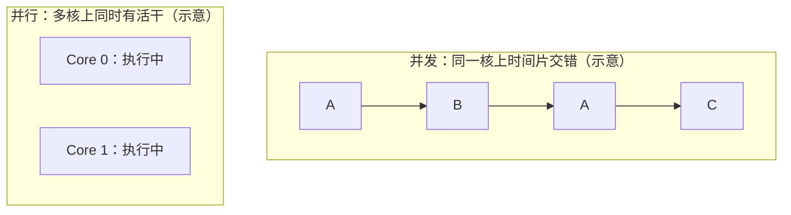
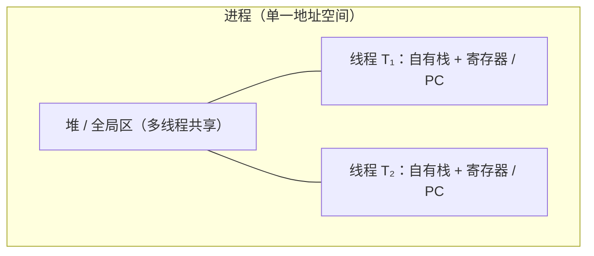
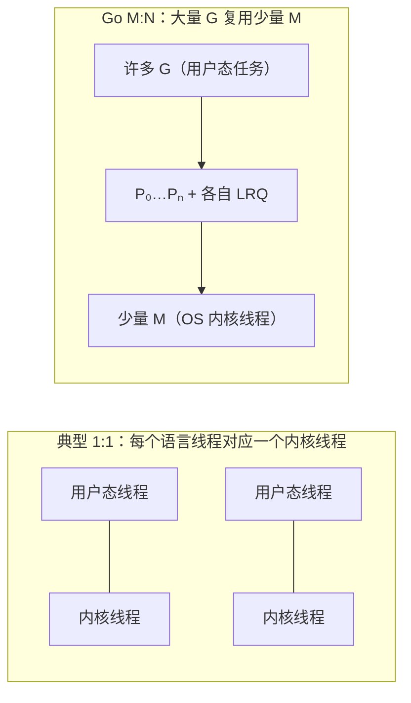
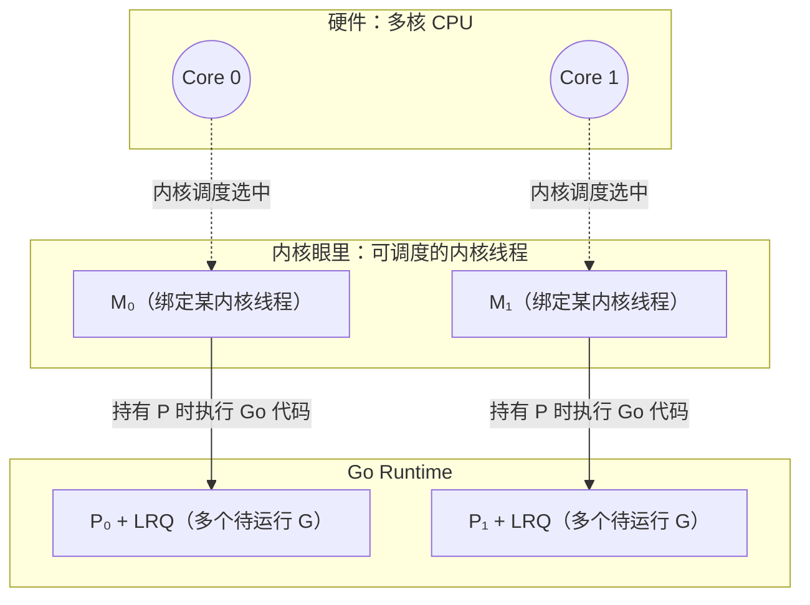
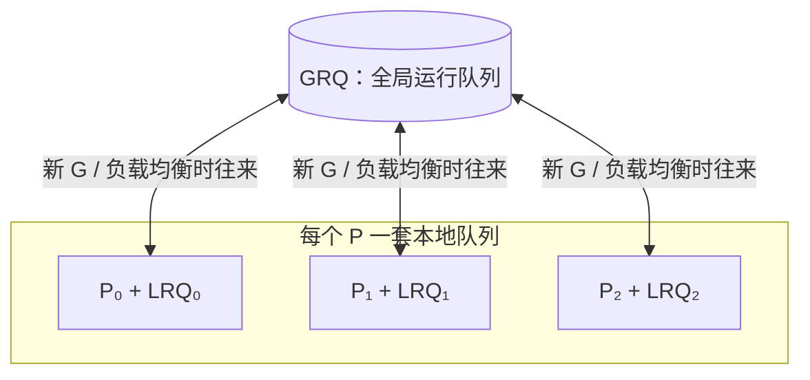
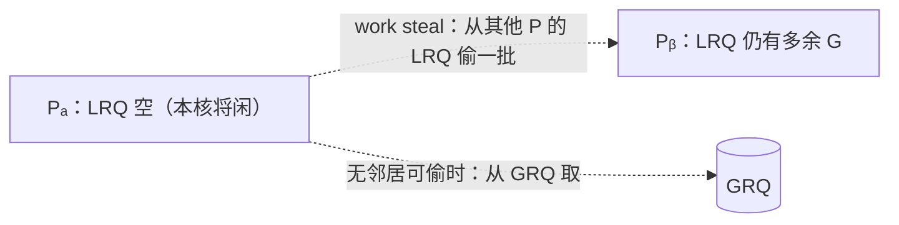

```yaml
title: Learn Concurrent Programming with Go
author: James Cutajar (Manning, 2023)
type: book
status: in-progress
tags:
  - go
  - concurrency
  - goroutines
  - channels
  - mutex
  - waitgroup
  - synchronization
  - concurrency-patterns
  - study-notes
```

# Chapter 1：为何用 Go 做并发 — 概念、立场与扩展直觉

本章主线：先统一 **并发 / 并行** 与 **单核上的并发为何成立**，再落到 **Go 的设计立场**（写对并发，并行交给 runtime）、**goroutine + 两套范式（CSP / 共享内存）**，最后用 **阿姆达尔 / 古斯塔夫森** 解释多核扩展的直觉与边界。

---

## 1. 并发是什么：时间上的交替，而非时刻上的「同时」

**Concurrent（并发）**：多个任务在时间段内**交替推进**，同一瞬间未必都在执行。

书里的目标表述可以压缩成一句：**写出健壮、可扩展的并发程序**。现代服务器普遍 **多核**，分布式与云原生又天然需要 **水平扩展**；Go 的并发原语（goroutine、channel 等）就是为这种环境准备的。

**单核上并发依然成立**：没有多核时，操作系统用 **时间片** 调度——某任务在 IO、等待、阻塞时，CPU 转去跑别的任务。此时 **微观上是串行**（同一时刻只有一个在跑），**宏观上像并行**；本质是用更好的 **排布策略** 吃掉空闲时间。

---

## 2. 并发与并行：分工不同，在 Go 里又常一起出现

| | **并发 Concurrency** | **并行 Parallelism** |
|---|------------------------|----------------------|
| 侧重 | 程序结构：任务如何拆分、协作、交替 | 执行方式：是否在同一时刻占用多个算力单元 |
| 依赖 | 语言与模型（goroutine、channel 等） | **硬件多核**（或等价的多执行单元） |
| 关系 | 单核也可有并发结构 | 没有多核就没有「真同时」意义上的并行 |

现代机房与云主机默认多核，因此：**用 Go 写好并发结构之后，常常能自然映射成多核上的并行执行**；但「结构上并发」并不自动等于「始终算对」，正确性仍要自己保证。



---

## 3. 设计立场：先写对并发，并行交给 Runtime 与硬件

> We should focus mainly on writing correct concurrent programs, letting  
> Go's runtime and hardware mechanics deal with parallelism.

开发者优先保证 **并发逻辑正确**（同步、通信、不变量、无数据竞争）；**多核上谁跑哪段、如何映射到线程、如何占满算力**，主要由 **Go runtime** 与 **CPU / OS 调度** 承担。这与「自己绑线程、自己算并行度」的传统负担形成对比。

**与传统 OS 线程模型对照**：传统路径里开发者往往要直面线程生命周期、栈与配额、调度与切换成本、线程间通信；线程 **重**，数量必须 **严控**。Go 则把大量「轻量并发单元」交给 runtime 管理（第二章展开 **G / P / M**）。

---

## 4. Goroutine：轻量、按需创建，但不是「无限魔法」

需要多少逻辑并发，就起多少 **goroutine**，不必像线程池那样为「线程个数」过度焦虑；**栈、调度、与内核线程的映射**由 runtime 处理。

仍会有人问：**goroutine 要不要设上限？** 相对传统线程，Go 通过轻量抽象与调度把 **数量硬约束** 大大放宽；但 **内存与调度压力** 仍在，无节制创建会导致堆积与延迟抖动——**业务上仍要有背压、池化或限流等策略**，只是动机从「线程太贵」扩展为「资源与可观测性」。

---

## 5. 两套并发范式：CSP（channel）与共享内存（锁等）

Go 提供基于 **CSP** 的抽象：**通过 `channel` 通信** 来协作，思维上贴近「谁把消息交给谁」，有助于减少共享可变状态上的竞态。

**CSP 不是银弹**：简单的临界区、计数器、缓存结构，用 **mutex、WaitGroup、条件变量** 等往往更直接。实践上常见组合：**能用通信表达清楚的用 channel；必须保护共享内存的用锁**，二者互补。

---

## 6. 为何还要学底层（与本书后文的关系）

日常开发不会自己实现调度器或锁；但理解 **调度、同步原语、内存模型** 能少踩坑（例如阻塞与调度交互、锁粒度、`select` 行为等）。第一章定目标与词汇，**第二章起把「runtime 如何把 goroutine 铺到多核」说具体**。

---

## 7. 算力扩展的两种直觉：阿姆达尔 vs 古斯塔夫森

### 7.1 阿姆达尔定律（Amdahl）

**固定问题规模** 时，加速比被程序里 **无法并行的串行部分** 卡死。书里的施工队比喻：人多未必总省总成本；代码里哪怕 **很小一段** 必须串行执行，多核上限也会被 **明显** 拉低——**加核不能无限变快**。


### 7.2 古斯塔夫森定律（Gustafson）

**问题规模随算力一起变大** 时的视角：若 **串行部分体量大致固定**、**新增核心总能被并发工作吃满**，则更容易叙述「更多核 → 吞吐更高 / 承接更大流量」。许多 **网关、微服务、批处理扩展** 更接近这种叙事：**核多了多干活**，而不是永远只做同一小坨固定计算。

### 7.3 与云原生后端的关系

典型线上服务：**请求与队列深度** 往往随资源扩展，额外 CPU 常能转化为 **更高并发处理量**；即便单机调度到瓶颈，还可 **水平扩容**。这也是 **Go + 多核服务器** 常见搭配的原因之一——**古斯塔夫森式场景多**，但 **阿姆达尔式瓶颈**（全局锁、单点协调、强串行阶段）仍要在架构与代码里主动规避。


# Chapter 2：从 OS 线程到 Goroutine — 调度与算力

本章主线：**goroutine 在运行时里如何被调度**，它与 **OS 内核线程**、**CPU 核心** 之间怎样配合；**blocking I/O** 时 **G 与 M** 如何解耦（**netpoller** 等）；以及 **work stealing**。顺带澄清：相对 **教科书式 N:1 green thread**，Go 常见赢面在哪里（**比较应落到实现代际**，不作「名词正统」之争）。

---

## 1. OS 眼里的并发：进程与线程

操作系统在**单核**上靠时间片轮转实现宏观并发；在**多核**上可同时跑多个内核调度实体。

- **进程**：资源与隔离的边界（地址空间、文件描述符等）。切换成本高，需要换页表、刷新 TLB 等。
- **线程（内核线程）**：OS 可调度的**执行上下文**——各自有栈、寄存器、程序计数器（PC）；同一进程内多线程**共享堆**，**不共享各自的用户栈**。
- **上下文切换**：内核保存/恢复线程状态（可联想到 PCB 等 bookkeeping），这是「线程很重」的主要来源之一。

多线程共享内存时，协作数据可走堆上的共享结构，不必像多进程那样频繁跨进程合并；但隔离弱于进程，一个线程严重错误可能影响整个进程。并发执行时，**各线程/协程的交错顺序一般不可事先保证**。



---

## 2. 用户态线程 vs 内核线程：Goroutine 站在哪一侧

- **内核线程（1:1）**：创建、阻塞、调度都由内核完成；阻塞 I/O 时线程挂起，由内核换别的线程上 CPU。模型简单，但线程数一大，调度与内存（每线程栈）压力大。
- **用户态线程（N:1 或配合运行时的 M:N）**：调度在用户空间完成，切换成本低，可轻松创建大量「轻量任务」。代价是：
  - 若某个用户态线程在**系统调用里阻塞**且运行时不知道，可能**拖住整条用户态线程**上的所有协程 → 因此用户态模型往往倾向 **non-blocking I/O** 或把阻塞操作交给少量专用内核线程。
  - 在**多核**上，若用户态调度器不把任务铺到多个内核执行体上，会出现「很多协程但只吃满一核」→ 需要 **M:N**：多个用户态任务映射到多个内核线程，才能用满 CPU。

**Goroutine** 是 Go 提供的用户侧并发单元；调度由 **Go runtime** 完成，而不是每个 goroutine 固定对应一个内核线程。

业界常说的 **green thread** / **虚拟线程（Java）** 都是「用户态调度 + 大量轻量任务」这一类思路；具体实现和语义因语言而异，**green thread 不是严谨的统一标准术语**，但沟通时多指这类模型。



---

## 3. Blocking I/O：netpoller、挂起 G，与「别让一次等等拖死全世界」

第 2 节已强调：用户态调度最怕执行体在**阻塞式系统调用**里睡死。若载体只有**一条内核线程**（典型 **N:1 green thread**），铆在上面的**所有**绿色线程都会一起停摆。

Go 的处理要**分路**看：网络等可整合进多路复用的路径，与「真的会占住 M」的路径，不一样。

### 3.1 网络：非阻塞 fd + netpoller（常见热路径）

对 **套接字** 等，Runtime 在支持的平台上把底层尽量做成 **非阻塞 I/O**，并用 **多路复用** 等机制等事件（如 Linux **`epoll`**、BSD **`kqueue`**、Windows **`IOCP`**）。社区里常把这套与网络相关的轮询与唤醒逻辑统称为 **netpoller**。直观流程：

1. 某 **G** 在连接上做 `Read` / `Write`，数据尚未就绪时，**不必**让「整条负责跑 Go 代码的调度世界」陪着在内核里傻等；
2. Runtime **挂起（park）** 该 **G**，把 **fd** 交给 poller；当前 **M** 仍可取 **P**、从 **LRQ** 拉别的 **G** 继续跑；
3. 内核通知 fd 可读写后，Runtime 把对应 **G** 标成 **runnable**，放回 **LRQ / GRQ** 参与调度。

要点：**等待网络数据** 的开销，尽量表现为「**占一个轻量 G 的状态**」，而不是「**占死所有 M、冻住全体 goroutine**」。这与 naive green thread 在**单载体**上阻塞形成对比。

### 3.2 仍会占住 M 的阻塞：部分文件 I/O、`cgo` 等

若调用路径**必须**在内核里阻塞到返回（典型如部分 **磁盘 / 文件** 操作、**`cgo`** 进原生库、或 poller **管不到** 的 syscall），**当前 M 仍可能被内核挂起**。此时 Runtime 仍会尽量 **把 P 从该 M 剥离**，交给其他 **M** 继续执行别的 **G**（细节随版本与平台变化，记结论即可：**一个 M 堵死 ≠ 整个进程里所有 G 都停**，但若大量 G 同时走「重阻塞 syscall」，仍可能堆出**很多阻塞 M** → 业务上仍要 **限流、池化、拆分磁盘与网络路径** 等）。

### 3.3 和 green thread 比「好」时，到底在比什么

「**Green thread**」在业界是**松散统称**；这里对比的是**教科书式 naive 模型**：**大量用户态任务铆在极少几条甚至一条内核线程上**，且运行时**没有**把网络等待从「占满载体」里剥离。

| 维度 | 典型 naive N:1 green thread | Go 的常见路径 |
|------|-----------------------------|----------------|
| 阻塞 syscall | 易 **拖死唯一（或极少）载体**，其上 **全部** 用户态任务停摆 | **多 M**：其他内核线程仍可取 **P** 推进 **G** |
| 网络等待 | 若未与非阻塞 + poller 深度整合，易长期占满载体 | **netpoller**：等待期 **G park**，**M** 可服务其他 **G** |
| 多核 | 常需**另起炉灶**才能把活铺到多核 | **P / M + stealing** 与 I/O 叙事在同一套 runtime 里 |

因此更贴切的说法是：**Go 的 goroutine = M:N + 与 OS 事件源协作的 netpoller（网络）+ 对「真阻塞 syscall」的 P 剥离等兜底**；相对 **早期单载体 green thread**，赢面主要在 **「网络等 I/O 不挡整根载体」** 与 **「多内核执行体分担 syscall 阻塞」**。新一代语言运行时（例如 **Java Virtual Threads** 的载体线程模型）也在吸收类似思想，**比较应落到实现代际与具体负载**，而不是抽象标签谁更「正宗」。


---

## 4. Goroutine 怎么「运作」：G、P、M 与 CPU

Go 采用 **M:N 混合模型**（大量 **G**oroutine 映射到多个 **M**）：

| 符号 | 含义（直观版） |
|------|----------------|
| **G** | Goroutine：要执行的 Go 代码与栈 |
| **M** | Machine：与 OS **内核线程**绑定的执行载体，真正参与内核调度、上 CPU |
| **P** | Processor：**逻辑处理器**，持有待运行 G 的**本地队列（LRQ）**，并关联调度所需资源；`GOMAXPROCS` 大致对应可同时参与调度的 P 数量 |

关系可以记成：**G 的代码要跑在 M 上，M 需要拿到 P 才能执行 Go 用户代码**；P 的数量与并行度、调度结构强相关。内核只认识 **M（内核线程）**；**CPU 核心**上跑的是内核选中的那个线程，runtime 通过「哪些 M 在跑、哪些 G 挂在哪些 P 上」把 goroutine 铺到多核上。



<details>
<summary>与内核线程强绑定：<code>runtime.LockOSThread</code></summary>

默认下 G 与 M 可解绑、调度器会迁移 G。需要线程局部状态或与 C/系统库约定「固定在某 OS 线程」时，可用 `runtime.LockOSThread` 把当前 G 钉在当前 M（进而钉在固定内核线程）上；有代价，仅必要时使用。
</details>

---

## 5. 调度在做什么：全局队列、本地队列与「别饿死」

Runtime 维护：

- **GRQ（Global Run Queue）**：全局待运行 G 队列。
- **LRQ（Local Run Queue，每个 P 一个）**：优先从这里取 G，减少锁竞争、提高局部性。

新建 goroutine、或从系统调用返回等路径下，G 可能进入 GRQ 或某个 P 的 LRQ。调度器的目标是：**尽快把可运行的 G 分给有 P 的 M**，让多核尽量有活干，同时控制锁与缓存行为。



---

## 6. Work stealing：多核下的负载均衡

当某个 **P 的 LRQ 空了**，而别的 P 上还有积压的 G 时，只盯自己的队列会导致该 M「闲着」、浪费核。**Work stealing** 让空闲的 P **从其他 P 的 LRQ（或 GRQ）偷一半或一批 G** 来跑，从而：

- 平衡各核负载；
- 缓解「任务全堆在一个队列里、其他 P 无事可做」；
- 与「优先 LRQ、少碰全局锁」的设计相容。

直觉：**本地队列快、全局队列兜底、偷邻居填空闲**，这是 Go 调度器在多核上保持吞吐的常见手段之一。



---

## 7. 与 Chapter 1 的呼应

Chapter 1 强调：开发者写清并发逻辑，并行与底层映射交给 runtime 与硬件。Chapter 2 把这句话落到机制上：**G 是逻辑并发单元，M 对接内核与 CPU，P 组织队列与并行窗口**；**网络 I/O 常见路径经 netpoller 与 G 挂起，减轻「一阻全停」**；**调度 + work stealing** 把大量 G 铺到有限的 M 与多核上。

---

## 8. 备忘问题的结论（原「待核对」条目的直接回答）

### 8.1 创建内核线程比创建进程「快多少倍」？

**没有一个跨平台、可写进教科书常数的「固定倍数」。** 口语或旧资料里的「快两个数量级 / 百倍」只能当**量级直觉**，不能当规格。

**原因**：所谓「创建进程」在测什么——`fork()` 后立刻 `exec()`？还是父子长期共存、COW 压力如何？线程路径在 Linux 上多是 `clone(CLONE_VM|…)`，与 `fork` 共享的实现细节、内核版本、seccomp、内存映射数量都会扭曲数字。

**文献与社区里较常见的结论**（量级，不是承诺）：

- 同机批量微基准里，`pthread_create` 一类路径相对「完整 `fork` 新进程」往往 **快数倍到数十倍** 都出现过；极端平台对比里 **接近两个数量级** 的报道也有，但 **不是** 在每台机器、每种负载下都能复现。
- 除**创建**外，**切换**也是线程更轻：进程切换常涉及地址空间与 **TLB** 等更重的工作；线程共享地址空间，切换成本通常更低。

**实用建议**：若需要数字，在**目标 OS / 内核版本**上写最小微基准（固定次数的 `fork` vs `pthread_create`），并说明是否 `exec`、是否预热；写笔记时用 **「明显更轻」+ 自测数量级** 比写死 **×100** 更诚实。

### 8.2 `green thread` 到底是什么、边界在哪里？

**没有单一权威定义**；它是**行业俗称**，论文与手册里更稳的表述是 **user-level threads（用户态线程）** 或 **M:N threading**，再往下必须写清 **具体实现**。

**历史上常被叫 green threads 的典型形态**：

- **早期 Java**：**N:1**，大量「绿色」用户态线程铆在**很少几条内核线程**上；阻塞 syscall 或调度缺陷容易「一损俱损」。后来主流 JVM 改为 **1:1 平台线程**；再到今天的 **Virtual Threads** 又回到「极多轻量任务 + 少量载体线程」，但实现是 **JDK 21+ 的 continuation / 载体模型**，与上世纪 green threads **不是同一套代码**。

**和 Go 怎么称呼才清楚**：

- 口语里有人把 **goroutine** 也叫 green thread，**沟通可以**，**技术上不精确**：Go 是 **runtime 调度的用户态并发单元 + M:N + netpoller**，不是「名字」之争，是 **是否与 OS / I/O 子系统协同** 之争。
- 写笔记或对外讲解时，优先说 **goroutine / user-level goroutine**，需要类比再说「与某某语言的 user-level scheduling 类似」。

**和另外两条线怎么区分记忆**：

| 体系 | 大致说法 |
|------|-----------|
| **早期 Java green threads** | 常指 **N:1、由用户态库调度**；与今天 **Virtual Threads** 目标相近、机制不同。 |
| **Java Virtual Threads** | **海量**虚拟线程映射到 **少量平台（内核）线程**；阻塞点可 **unmount**，让载体去干别的；思路与 Go「park + 多载体」**可比**，实现细节读 OpenJDK 文档与 JEP。 |
| **Erlang / BEAM** | **轻量 process**（非 OS process），**抢占式**调度、**独立堆**、消息传递；**不是**「共享大堆上的 green thread」那一路，类比时容易误导，宜单独记「actor + 独立堆」。 |

**一句话**：**green thread ≈ 常被用来指用户态调度的轻量线程**；要严谨就写 **实现名（goroutine / virtual thread / BEAM process）** 和 **N:1 / M:N / 1:1**，少争标签。

---

## 配套示例代码（读完 Ch1–2）

同一组「假工作」（`Sleep` 1s）对比 **串行**、**用 Sleep 等 goroutine 的反例**、以及 **`sync.WaitGroup` 正确等待**（对应 Chapter 1 里「临界区 / 同步原语」那条线）。

| 目录 | 说明 |
|------|------|
| [`cmd/01-sequential`](./cmd/01-sequential/main.go) | 串行执行，总耗时约 5s |
| [`cmd/02-goroutines-sleep`](./cmd/02-goroutines-sleep/main.go) | 起多个 goroutine 但用固定 `Sleep` 赌结束——**不可靠**，仅作对照 |
| [`cmd/03-goroutines-waitgroup`](./cmd/03-goroutines-waitgroup/main.go) | `WaitGroup` 等到全部 `Done`，总耗时约 1s（多核/调度允许时接近并行墙钟） |

在仓库 `note-01` 目录下：

```bash
go run ./cmd/01-sequential
go run ./cmd/02-goroutines-sleep
go run ./cmd/03-goroutines-waitgroup
```
