```yaml
title: Learn Concurrent Programming with Go
author: James Cutajar (Manning, 2023)
type: book
status: in-progress
tags:
  - go
  - concurrency
  - goroutines
  - channels
  - mutex
  - waitgroup
  - synchronization
  - concurrency-patterns
  - study-notes
```

## `note-01` 仓库结构

| 路径 | 内容 |
|------|------|
| **`README.md`** | 全书笔记 **Ch1–Ch7**（并发模型、调度、内存与竞态、锁与读写锁、**Cond 与信号量**、**WaitGroup / Semaphore / Barrier**、**CSP 与 channel**）；附录为 **`cmd/`** 示例索引。 |
| **`cmd/<name>/main.go`** | 与章节对应的小程序；在 **`note-01`** 根目录执行 **`go run ./cmd/<name>`** 或 **`go build ./...`**。 |
| **`go.mod`** | Module 路径与 Go 版本。 |

---

# Chapter 1：为何用 Go 做并发 — 概念、立场与扩展直觉

**本章主线**：先统一 **并发 / 并行** 与 **单核上的并发为何成立**，再落到 **Go 的设计立场**（写对并发，并行交给 runtime）、**goroutine + 两套范式（CSP / 共享内存）**，最后用 **阿姆达尔 / 古斯塔夫森** 解释多核扩展的直觉与边界。

**本章摘要**

| 主题 | 说明 |
|------|------|
| 并发 | **时间段内交替推进**，同一瞬间未必都在跑 |
| 并行 | **同一时刻**多个算力单元上真有活干，依赖 **多核等硬件** |
| Go 立场 | 人写 **并发正确性**；**并行度与映射**交给 **runtime + CPU/OS** |
| Goroutine | **轻、多**；仍要 **限流/背压**，不是无限魔法 |
| 两套范式 | **Channel（CSP）** 通信；**Mutex 等** 守共享内存；常 **混用** |
| 阿姆达尔 | **固定题** + 有串行比例 \(B\) → 加速比 **有硬顶** \( \approx 1/B \) |
| 古斯塔夫森 | **题随算力变大**、并行段能吃满核 → **吞吐**更易随核涨 |

---

## 1. 并发是什么：时间上的交替，而非时刻上的「同时」

**Concurrent（并发）**：多个任务在时间段内**交替推进**，同一瞬间未必都在执行。

书里的目标表述可以压缩成一句：**写出健壮、可扩展的并发程序**。现代服务器普遍 **多核**，分布式与云原生又天然需要 **水平扩展**；Go 的并发原语（goroutine、channel 等）就是为这种环境准备的。

**单核上并发依然成立**：没有多核时，操作系统用 **时间片** 调度——某任务在 IO、等待、阻塞时，CPU 转去跑别的任务。此时 **微观上是串行**（同一时刻只有一个在跑），**宏观上像并行**；本质是用更好的 **排布策略** 吃掉空闲时间。

---

## 2. 并发与并行：分工不同，在 Go 里又常一起出现

|      | **并发 Concurrency**                | **并行 Parallelism**                     |
| ---- | ----------------------------------- | ---------------------------------------- |
| 侧重 | 程序结构：任务如何拆分、协作、交替  | 执行方式：是否在同一时刻占用多个算力单元 |
| 依赖 | 语言与模型（goroutine、channel 等） | **硬件多核**（或等价的多执行单元）       |
| 关系 | 单核也可有并发结构                  | 没有多核就没有「真同时」意义上的并行     |

现代机房与云主机默认多核，因此：**用 Go 写好并发结构之后，常常能自然映射成多核上的并行执行**；但「结构上并发」并不自动等于「始终算对」，正确性仍要自己保证。

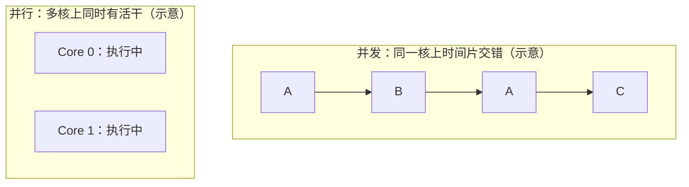

---

## 3. 设计立场：先写对并发，并行交给 Runtime 与硬件

> We should focus mainly on writing correct concurrent programs, letting  
> Go's runtime and hardware mechanics deal with parallelism.

开发者优先保证 **并发逻辑正确**（同步、通信、不变量、无数据竞争）；**多核上谁跑哪段、如何映射到线程、如何占满算力**，主要由 **Go runtime** 与 **CPU / OS 调度** 承担。这与「自己绑线程、自己算并行度」的传统负担形成对比。

**与传统 OS 线程模型对照**：传统路径里开发者往往要直面线程生命周期、栈与配额、调度与切换成本、线程间通信；线程 **重**，数量必须 **严控**。Go 则把大量「轻量并发单元」交给 runtime 管理（第二章展开 **G / P / M**）。

---

## 4. Goroutine：轻量、按需创建，但不是「无限魔法」

需要多少逻辑并发，就起多少 **goroutine**，不必像线程池那样为「线程个数」过度焦虑；**栈、调度、与内核线程的映射**由 runtime 处理。

仍会有人问：**goroutine 要不要设上限？** 相对传统线程，Go 通过轻量抽象与调度把 **数量硬约束** 大大放宽；但 **内存与调度压力** 仍在，无节制创建会导致堆积与延迟抖动——**业务上仍要有背压、池化或限流等策略**，只是动机从「线程太贵」扩展为「资源与可观测性」。

---

## 5. 两套并发范式：CSP（channel）与共享内存（锁等）

Go 提供基于 **CSP** 的抽象：**通过 `channel` 通信** 来协作，思维上贴近「谁把消息交给谁」，有助于减少共享可变状态上的竞态。

**CSP 不是银弹**：简单的临界区、计数器、缓存结构，用 **mutex、WaitGroup、条件变量** 等往往更直接。实践上常见组合：**能用通信表达清楚的用 channel；必须保护共享内存的用锁**，二者互补。

**代码对照（语义以内存模型为准）** — 用 channel 表达「做完再往下走」（`close` / 接收配合；生产代码常还带 `context` 取消）：

```go
package main

func main() {
	done := make(chan struct{})
	go func() {
		// ... 一段并发任务 ...
		close(done)
	}()
	<-done // 等待 goroutine 发出「完成」信号
}
```

同一逻辑若共享 `int` 计数，用 **mutex** 保护 **读改写**：

```go
package main

import "sync"

func main() {
	var mu sync.Mutex
	var counter int
	mu.Lock()
	counter++
	mu.Unlock()
}
```

**选型补充**：协作关系若适合表达成 **「谁把完成信号或数据交给谁」**（流水线、扇入扇出、取消传播），`channel` 往往更清楚；若是 **少量共享可变状态** 上的 **不变量保护**（计数器、`map`、小缓存），`mutex`（配合 `WaitGroup` 等）通常更直接。生产代码里 **两者常混用**，以 **可读性与不变量是否好证** 为准。

---

## 6. 为何还要学底层（与本书后文的关系）

日常开发不会自己实现调度器或锁；但理解 **调度、同步原语、内存模型** 能少踩坑（例如阻塞与调度交互、锁粒度、`select` 行为等）。第一章定目标与词汇，**第二章起把「runtime 如何把 goroutine 铺到多核」说具体**。

---

## 7. 算力扩展的两种直觉：阿姆达尔 vs 古斯塔夫森

### 7.1 阿姆达尔定律（Amdahl）

**固定问题规模** 时，加速比被程序里 **无法并行的串行部分** 卡死。书里的施工队比喻：人多未必总省总成本；代码里哪怕 **很小一段** 必须串行执行，多核上限也会被 **明显** 拉低——**加核不能无限变快**。


**公式（固定总工作量、理想并行）**：设串行部分占比为 \(B \in (0,1]\)，处理器数为 \(N\)，则加速比常见上界为

\[
S(N) \;\lesssim\; \frac{1}{\,B + \dfrac{1-B}{N}\,}.
\]

令 \(N \to \infty\)，得 \(S \to 1/B\)。**数值直觉**：若 \(B=5\%\)，则无论堆多少核，**理想墙钟加速比也难超过约 \(20\times\)**——这就是「串行瓶颈」的定量味道。（真实程序还有通信、同步、内存墙等，只会更差。）

### 7.2 古斯塔夫森定律（Gustafson）

**问题规模随算力一起变大** 时的视角：若 **串行部分体量大致固定**、**新增核心总能被并发工作吃满**，则更容易叙述「更多核 → 吞吐更高 / 承接更大流量」。许多 **网关、微服务、批处理扩展** 更接近这种叙事：**核多了多干活**，而不是永远只做同一小坨固定计算。

**与阿姆达尔的对比（两种模型的前提不同）**：阿姆达尔问的是「**同一题**做更快要多快」；古斯塔夫森问的是「**算力变多以后题是否一起变大**」。若并行段工作量随 \(N\) **线性放大**、且都能被 \(N\) 个处理器吃满，**墙钟**可接近 **线性**，不会像固定小串行段那样被 \(1/B\) **绝对钉死**。

### 7.3 与云原生后端的关系

典型线上服务：**请求与队列深度** 往往随资源扩展，额外 CPU 常能转化为 **更高并发处理量**；即便单机调度到瓶颈，还可 **水平扩容**。这也是 **Go + 多核服务器** 常见搭配的原因之一——**古斯塔夫森式场景多**，但 **阿姆达尔式瓶颈**（全局锁、单点协调、强串行阶段）仍要在架构与代码里主动规避。

# Chapter 2：从 OS 线程到 Goroutine — 调度与算力

**本章主线**：**goroutine** 如何被调度；与 **OS 内核线程**、**CPU** 的关系；**blocking I/O** 下 **G/M** 与 **netpoller**；**work stealing**；与 naive **N:1 green thread** 对比时 **比什么**（看实现代际，不争名词）。

**本章摘要**

| 概念 | 说明 |
|------|------|
| **进程** | 资源与隔离边界；**切换重**（页表、TLB 等） |
| **内核线程** | OS 调度单位；**各自栈**，**共享堆** |
| **G** | Goroutine，用户侧 **大量** 逻辑并发 |
| **M** | 绑 **内核线程**，真上 CPU 的是这条线 |
| **P** | 逻辑处理器 + **LRQ**；`GOMAXPROCS` ≈ 活跃 **P** 数 |
| **关系** | **G 跑在 M 上，M 须持 P** 才跑这段 Go 代码 |
| **网络阻塞** | **G park** + **netpoller**；**M** 可去跑别的 **G** |
| **重 syscall** | 可能 **占住 M**；runtime 尽量 **拆 P**；大量阻塞仍要业务治理 |
| **GRQ / LRQ** | 全局队列 + **每 P 本地队列**；优先本地 |
| **Work stealing** | **本地空** → 从 **邻居 LRQ / GRQ** 偷任务，填空闲核 |

---

## 1. OS 眼里的并发：进程与线程

操作系统在**单核**上靠时间片轮转实现宏观并发；在**多核**上可同时跑多个内核调度实体。

- **进程**：资源与隔离的边界（地址空间、文件描述符等）。切换成本高，需要换页表、刷新 TLB 等。
- **线程（内核线程）**：OS 可调度的**执行上下文**——各自有栈、寄存器、程序计数器（PC）；同一进程内多线程**共享堆**，**不共享各自的用户栈**。
- **上下文切换**：内核保存/恢复线程状态（可联想到 PCB 等 bookkeeping），这是「线程很重」的主要来源之一。

多线程共享内存时，协作数据可走堆上的共享结构，不必像多进程那样频繁跨进程合并；但隔离弱于进程，一个线程严重错误可能影响整个进程。并发执行时，**各线程/协程的交错顺序一般不可事先保证**。

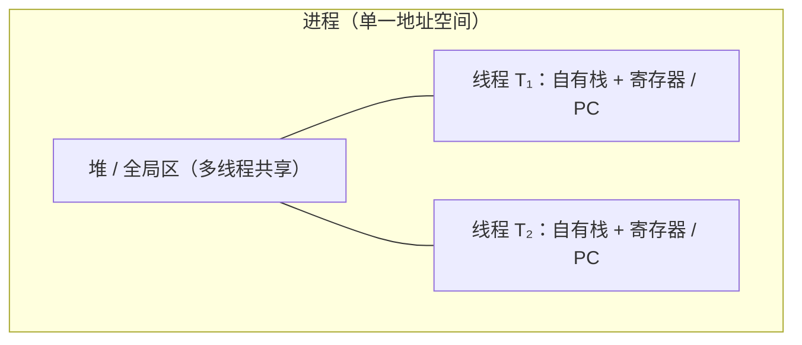

---

## 2. 用户态线程 vs 内核线程：Goroutine 站在哪一侧

- **内核线程（1:1）**：创建、阻塞、调度都由内核完成；阻塞 I/O 时线程挂起，由内核换别的线程上 CPU。模型简单，但线程数一大，调度与内存（每线程栈）压力大。
- **用户态线程（N:1 或配合运行时的 M:N）**：调度在用户空间完成，切换成本低，可轻松创建大量「轻量任务」。代价是：
  - 若某个用户态线程在**系统调用里阻塞**且运行时不知道，可能**拖住整条用户态线程**上的所有协程 → 因此用户态模型往往倾向 **non-blocking I/O** 或把阻塞操作交给少量专用内核线程。
  - 在**多核**上，若用户态调度器不把任务铺到多个内核执行体上，会出现「很多协程但只吃满一核」→ 需要 **M:N**：多个用户态任务映射到多个内核线程，才能用满 CPU。

**Goroutine** 是 Go 提供的用户侧并发单元；调度由 **Go runtime** 完成，而不是每个 goroutine 固定对应一个内核线程。

业界常说的 **green thread** / **虚拟线程（Java）** 都是「用户态调度 + 大量轻量任务」这一类思路；具体实现和语义因语言而异，**green thread 不是严谨的统一标准术语**，但沟通时多指这类模型。

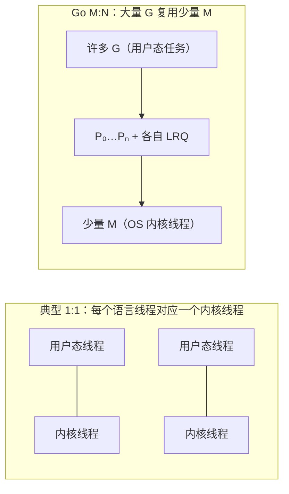

---

## 3. Blocking I/O：netpoller、挂起 G，与「别让一次等等拖死全世界」

第 2 节已强调：用户态调度最怕执行体在**阻塞式系统调用**里睡死。若载体只有**一条内核线程**（典型 **N:1 green thread**），铆在上面的**所有**绿色线程都会一起停摆。

Go 的处理要**分路**看：网络等可整合进多路复用的路径，与「真的会占住 M」的路径，不一样。

### 3.1 网络：非阻塞 fd + netpoller（常见热路径）

对 **套接字** 等，Runtime 在支持的平台上把底层尽量做成 **非阻塞 I/O**，并用 **多路复用** 等机制等事件（如 Linux **`epoll`**、BSD **`kqueue`**、Windows **`IOCP`**）。社区里常把这套与网络相关的轮询与唤醒逻辑统称为 **netpoller**。直观流程：

1. 某 **G** 在连接上做 `Read` / `Write`，数据尚未就绪时，**不必**让「整条负责跑 Go 代码的调度世界」陪着在内核里傻等；
2. Runtime **挂起（park）** 该 **G**，把 **fd** 交给 poller；当前 **M** 仍可取 **P**、从 **LRQ** 拉别的 **G** 继续跑；
3. 内核通知 fd 可读写后，Runtime 把对应 **G** 标成 **runnable**，放回 **LRQ / GRQ** 参与调度。

**结论**：**等待网络数据** 的开销，尽量表现为「**占一个轻量 G 的状态**」，而不是「**占死所有 M、冻住全体 goroutine**」。这与 naive green thread 在**单载体**上阻塞形成对比。

### 3.2 仍会占住 M 的阻塞：部分文件 I/O、`cgo` 等

若调用路径**必须**在内核里阻塞到返回（典型如部分 **磁盘 / 文件** 操作、**`cgo`** 进原生库、或 poller **管不到** 的 syscall），**当前 M 仍可能被内核挂起**。此时 Runtime 仍会尽量 **把 P 从该 M 剥离**，交给其他 **M** 继续执行别的 **G**（细节随版本与平台变化；**一个 M 堵死并不等于整个进程里所有 G 都停**，但若大量 G 同时走「重阻塞 syscall」，仍可能堆出**很多阻塞 M** → 业务上仍要 **限流、池化、拆分磁盘与网络路径** 等）。

### 3.3 和 green thread 比「好」时，到底在比什么

「**Green thread**」在业界是**松散统称**；这里对比的是**教科书式 naive 模型**：**大量用户态任务铆在极少几条甚至一条内核线程上**，且运行时**没有**把网络等待从「占满载体」里剥离。

| 维度         | 典型 naive N:1 green thread                                 | Go 的常见路径                                            |
| ------------ | ----------------------------------------------------------- | -------------------------------------------------------- |
| 阻塞 syscall | 易 **拖死唯一（或极少）载体**，其上 **全部** 用户态任务停摆 | **多 M**：其他内核线程仍可取 **P** 推进 **G**            |
| 网络等待     | 若未与非阻塞 + poller 深度整合，易长期占满载体              | **netpoller**：等待期 **G park**，**M** 可服务其他 **G** |
| 多核         | 常需**另起炉灶**才能把活铺到多核                            | **P / M + stealing** 与 I/O 叙事在同一套 runtime 里      |

因此更贴切的说法是：**Go 的 goroutine = M:N + 与 OS 事件源协作的 netpoller（网络）+ 对「真阻塞 syscall」的 P 剥离等兜底**；相对 **早期单载体 green thread**，赢面主要在 **「网络等 I/O 不挡整根载体」** 与 **「多内核执行体分担 syscall 阻塞」**。新一代语言运行时（例如 **Java Virtual Threads** 的载体线程模型）也在吸收类似思想，**比较应落到实现代际与具体负载**，而不是抽象标签谁更「正宗」。


---

## 4. Goroutine 怎么「运作」：G、P、M 与 CPU

Go 采用 **M:N 混合模型**（大量 **G**oroutine 映射到多个 **M**）：

| 符号  | 含义（直观版）                                                                                                                  |
| ----- | ------------------------------------------------------------------------------------------------------------------------------- |
| **G** | Goroutine：要执行的 Go 代码与栈                                                                                                 |
| **M** | Machine：与 OS **内核线程**绑定的执行载体，真正参与内核调度、上 CPU                                                             |
| **P** | Processor：**逻辑处理器**，持有待运行 G 的**本地队列（LRQ）**，并关联调度所需资源；`GOMAXPROCS` 大致对应可同时参与调度的 P 数量 |

关系可以记成：**G 的代码要跑在 M 上，M 需要拿到 P 才能执行 Go 用户代码**；P 的数量与并行度、调度结构强相关。内核只认识 **M（内核线程）**；**CPU 核心**上跑的是内核选中的那个线程，runtime 通过「哪些 M 在跑、哪些 G 挂在哪些 P 上」把 goroutine 铺到多核上。

**`GOMAXPROCS`**：进程级可调「参与 **P** 逻辑的并行度」；`runtime.GOMAXPROCS(0)` **只查询**当前值。调试竞态时偶见 `GOMAXPROCS=1` 放大交错，**不等于**生产应设单核。

```go
import "runtime"
// runtime.GOMAXPROCS(0) // 查询
```

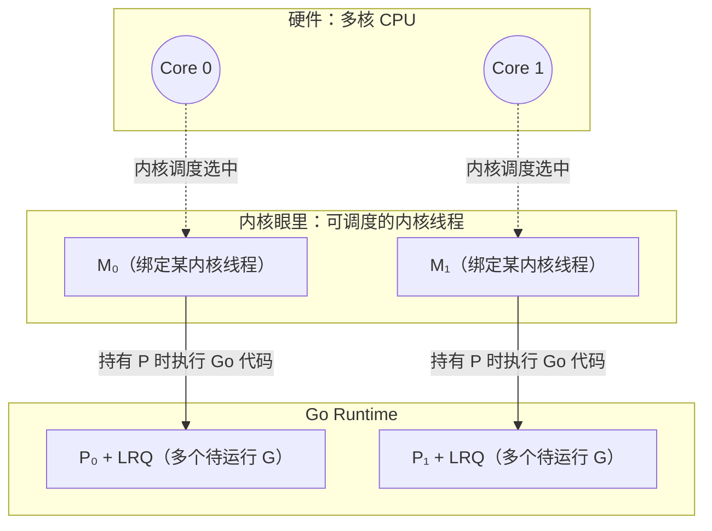

<details>
<summary>与内核线程强绑定：<code>runtime.LockOSThread</code></summary>

默认下 G 与 M 可解绑、调度器会迁移 G。需要线程局部状态或与 C/系统库约定「固定在某 OS 线程」时，可用 `runtime.LockOSThread` 把当前 G 钉在当前 M（进而钉在固定内核线程）上；有代价，仅必要时使用。

</details>

---

## 5. 调度在做什么：全局队列、本地队列与「别饿死」

Runtime 维护：

- **GRQ（Global Run Queue）**：全局待运行 G 队列。
- **LRQ（Local Run Queue，每个 P 一个）**：优先从这里取 G，减少锁竞争、提高局部性。

新建 goroutine、或从系统调用返回等路径下，G 可能进入 GRQ 或某个 P 的 LRQ。调度器的目标是：**尽快把可运行的 G 分给有 P 的 M**，让多核尽量有活干，同时控制锁与缓存行为。

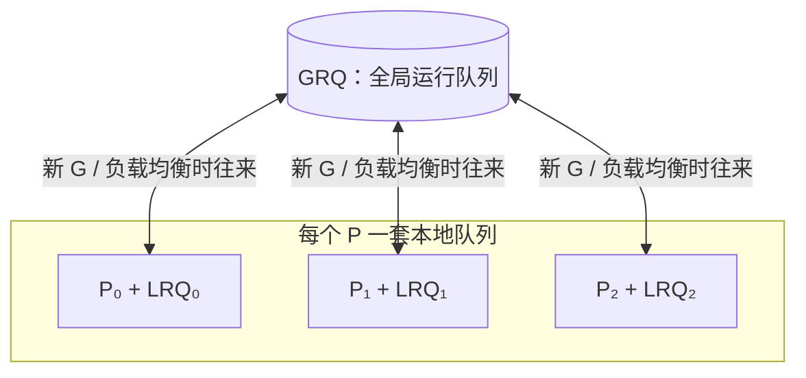

---

## 6. Work stealing：多核下的负载均衡

当某个 **P 的 LRQ 空了**，而别的 P 上还有积压的 G 时，只盯自己的队列会导致该 M「闲着」、浪费核。**Work stealing** 让空闲的 P **从其他 P 的 LRQ（或 GRQ）偷一半或一批 G** 来跑，从而：

- 平衡各核负载；
- 缓解「任务全堆在一个队列里、其他 P 无事可做」；
- 与「优先 LRQ、少碰全局锁」的设计相容。

直觉：**本地队列快、全局队列兜底、偷邻居填空闲**，这是 Go 调度器在多核上保持吞吐的常见手段之一。

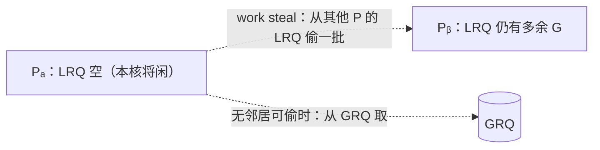

---

## 7. 与 Chapter 1 的呼应

Chapter 1 强调：开发者写清并发逻辑，并行与底层映射交给 runtime 与硬件。Chapter 2 把这句话落到机制上：**G 是逻辑并发单元，M 对接内核与 CPU，P 组织队列与并行窗口**；**网络 I/O 常见路径经 netpoller 与 G 挂起，减轻「一阻全停」**；**调度 + work stealing** 把大量 G 铺到有限的 M 与多核上。

---

## 8. 延伸：线程/进程成本与「green thread」用语

### 8.1 创建内核线程比创建进程「快多少倍」？

**没有一个跨平台、可写进教科书常数的「固定倍数」。** 口语或旧资料里的「快两个数量级 / 百倍」只能当**量级直觉**，不能当规格。

**原因**：所谓「创建进程」在测什么——`fork()` 后立刻 `exec()`？还是父子长期共存、COW 压力如何？线程路径在 Linux 上多是 `clone(CLONE_VM|…)`，与 `fork` 共享的实现细节、内核版本、seccomp、内存映射数量都会扭曲数字。

**文献与社区里较常见的结论**（量级，不是承诺）：

- 同机批量微基准里，`pthread_create` 一类路径相对「完整 `fork` 新进程」往往 **快数倍到数十倍** 都出现过；极端平台对比里 **接近两个数量级** 的报道也有，但 **不是** 在每台机器、每种负载下都能复现。
- 除**创建**外，**切换**也是线程更轻：进程切换常涉及地址空间与 **TLB** 等更重的工作；线程共享地址空间，切换成本通常更低。

**若要定量**：在**目标 OS / 内核版本**上做最小微基准（固定次数的 `fork` vs `pthread_create`），并写明是否 `exec`、是否预热；对外汇报时用 **自测范围** 比写死 **×100** 一类常数更可靠。

### 8.2 `green thread` 到底是什么、边界在哪里？

**没有单一权威定义**；它是**行业俗称**，论文与手册里更稳的表述是 **user-level threads（用户态线程）** 或 **M:N threading**，再往下必须写清 **具体实现**。

**历史上常被叫 green threads 的典型形态**：

- **早期 Java**：**N:1**，大量「绿色」用户态线程铆在**很少几条内核线程**上；阻塞 syscall 或调度缺陷容易「一损俱损」。后来主流 JVM 改为 **1:1 平台线程**；再到今天的 **Virtual Threads** 又回到「极多轻量任务 + 少量载体线程」，但实现是 **JDK 21+ 的 continuation / 载体模型**，与上世纪 green threads **不是同一套代码**。

**和 Go 怎么称呼才清楚**：

- 口语里有人把 **goroutine** 也叫 green thread，**沟通可以**，**技术上不精确**：Go 是 **runtime 调度的用户态并发单元 + M:N + netpoller**，不是「名字」之争，是 **是否与 OS / I/O 子系统协同** 之争。
- 技术写作与对外沟通时，优先用 **goroutine** 或 **user-level goroutine**，需要类比再提「与某某语言的 user-level scheduling 类似」。

**和另外两条线怎么区分记忆**：

| 体系                        | 大致说法                                                                                                                                                           |
| --------------------------- | ------------------------------------------------------------------------------------------------------------------------------------------------------------------ |
| **早期 Java green threads** | 常指 **N:1、由用户态库调度**；与今天 **Virtual Threads** 目标相近、机制不同。                                                                                      |
| **Java Virtual Threads**    | **海量**虚拟线程映射到 **少量平台（内核）线程**；阻塞点可 **unmount**，让载体去干别的；思路与 Go「park + 多载体」**可比**，实现细节读 OpenJDK 文档与 JEP。         |
| **Erlang / BEAM**           | **轻量 process**（非 OS process），**抢占式**调度、**独立堆**、消息传递；与「共享大堆 + 用户态线程」模型差别大，类比时容易误导，适合按 **actor + 独立堆** 单独理解。 |

**一句话**：**green thread ≈ 常被用来指用户态调度的轻量线程**；要严谨就写 **实现名（goroutine / virtual thread / BEAM process）** 和 **N:1 / M:N / 1:1**，少争标签。

---

# Chapter 3：共享内存与协调 — 从硬件直觉到竞态与逃逸

**本章主线**：多 **goroutine** 下 **共享内存** 为何 **陈旧读 / 撕裂**；**缓存与一致性** 直觉；**数据竞争** 与 **`-race`**；**逃逸** 与 **堆 / GC**；从「串行心智」到 **并发仍须正确**。

**本章摘要**

| 主题 | 说明 |
|------|------|
| 物理现实 | 数据经 **寄存器 → 缓存 → 主存**；**无同步** 就不能假设 **立即可见** |
| 重排 | **单 goroutine as-if**；**跨 goroutine** 无 hb 则 **不能按源码顺序推断** |
| 契约 | **[Go Memory Model](https://go.dev/ref/mem)**：要靠 **mutex / chan / atomic / WaitGroup…** 建 **happens-before** |
| MESI | 硬件用状态机维护 **缓存行** 一致性；**编程仍靠语言级同步** |
| False sharing | **不同变量** 在同 **缓存行** → 核间 **颠簸**；要 **分片 / 重排 / padding** |
| Data race | **并发** + **同址** + **至少一写** + **无 hb** → **非法、结果无定义** |
| `-race` | 好用、**贵**、**未跑到则无报告** |
| 逃逸 | **不能只在栈上活** → **堆**；影响 **GC**；用 **`-gcflags=-m`** 看 |
| `main` | 在 **启动 goroutine** 里；`main` 返回 **未等的 goroutine 可能被掐** |

---

## 1. 为何要谈硬件：共享 ≠「大家永远看到同一份当下」

多个 goroutine 读写同一块内存，逻辑上都在「同一进程地址空间」里，但 **物理上** 数据会经过 **寄存器 → 多级缓存 → 主存**。**没有正确同步** 时，一个执行流在缓存里看到的值，可能与另一个执行流刚写入的效果 **在时间上交错**，表现为 **陈旧读**、**非原子组合读写被撕开** 等——这是 **内存模型** 与 **同步原语** 存在的硬件动机。

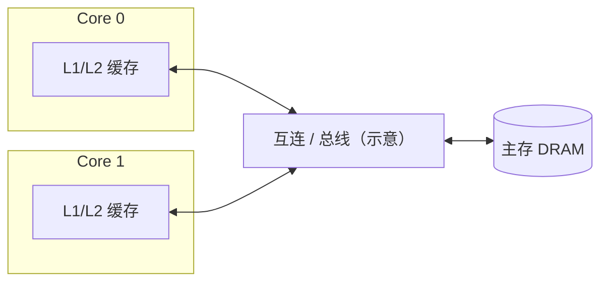

### 1.1 编译器、CPU 与「重排」

在 **单 goroutine** 内，编译器与 CPU 可在 **as-if 语义** 下调整读写顺序，只要 **该 goroutine 单独观测** 的结果不变。扩展到 **多 goroutine** 时：若没有 **同步** 建立跨 goroutine 的次序关系，就 **不能** 凭「源码从上到下」臆断别的 goroutine 何时看到某次写入——**既可能晚到，也可能因优化看起来像「乱序」**。

### 1.2 编程层契约：Go Memory Model

若 goroutine **A** 的写要对 goroutine **B** 的读 **有定义地可见**，语言要求二者之间存在 **happens-before** 关系（由 `mutex`、`channel` 收发、`sync/atomic` 等建立）。**无同步则无跨 goroutine 的可见性保证**。权威文档：[The Go Memory Model](https://go.dev/ref/mem)。

---

## 2. 缓存与一致性：为何 T1 更新后 T2 仍可能「读到旧值」（直觉）

典型故事（示意，非某条具体指令的时序保证）：

1. **T1** 从主存读变量，副本进入 **自己的缓存**，在缓存里改写；
2. **T2** 仍可能读到 **自己缓存里未失效的旧副本**，或读到 **写尚未传播到 T2 可见次序** 的中间状态。

工程上靠 **缓存一致性协议**（如常听到的 **MESI** 一类：Modified / Exclusive / Shared / Invalid 等状态）配合 **总线侦听（snooping）或目录式** 等，在硬件层尽量保证「多核对同一线路的可见性规则」。各 CPU 实现细节不同；**写 Go 时**应依赖 **[Go Memory Model](https://go.dev/ref/mem)** 与 **`sync` / `atomic` / channel** 等，而不是依赖对 MESI 行为的猜测。

**写策略**（write-through / write-back）与 **侦听、失效 / 更新** 等，都是为了一致性与性能折中。多核扩展时，一致性流量本身也会成为瓶颈之一（有时与「内存墙」一起讨论）；**多核对同一条缓存线频繁写** 时成本尤其明显。

### 2.1 MESI 四态（硬件里常见的状态名）

| 字母  | 状态      | 一句话（非形式化）                     |
| ----- | --------- | -------------------------------------- |
| **M** | Modified  | 本核缓存行已改，与主存不一致，独占     |
| **E** | Exclusive | 独占且与主存一致                       |
| **S** | Shared    | 多核可读共享；要写通常需让其他副本失效 |
| **I** | Invalid   | 本地副本作废，再读需重新装载           |

侦听总线、失效/更新，都是让各行在各核的 **状态机** 上合法迁移；**程序员仍须用语言级同步**，不能靠「猜 MESI 碰巧够用了」来写并发。

### 2.2 False sharing（伪共享）

两个 goroutine 写 **不同变量**，但若它们落在 **同一缓存行**（常见 **64B** 量级，依 CPU 而定），硬件仍按 **行** 维护一致性——结果像两人在抢 **同一把隐形锁**：缓存行在核间 **反复失效/回填**，吞吐暴跌。

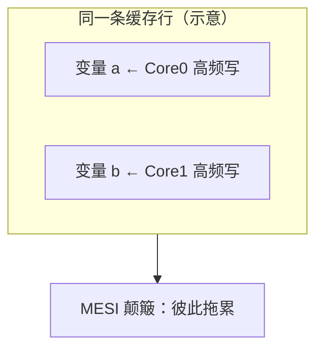

缓解思路：**按核/按线程分片统计**（每片独占一行）、`struct` **字段重排**、必要时 **手动 padding** 把热点字段隔开（以剖析为准，勿盲 pad）。

---

## 3. 数据竞争（data race）与竞态（race condition）

- **数据竞争（更偏定义）**：两个或多个 goroutine **并发** 访问同一内存位置，**至少一个是写**，且 **没有 happens-before 关系** 来保证顺序。Go 里 **有数据竞争的程序是非法的**（语义上不可靠），可能看似能跑、结果却错。
- **竞态（更偏现象）**：程序行为依赖 **谁先谁后** 的交错时序；常由数据竞争引起，但「逻辑上抢同一条业务路径」也可在更高层讨论。

**何时常见**：共享计数器、懒初始化、`map` 并发写、**读改写**（`x++`）非原子组合、闭包 **错误捕获循环变量** 后并发启动等。

**建立 happens-before 的常用手段**（精确条件以 [Go Memory Model](https://go.dev/ref/mem) 为准，此处只列直觉）：

- **`sync.Mutex` / `RWMutex`**：对同一 mutex，`Unlock` happens before 后序成功 `Lock`。
- **`sync.WaitGroup`**：当计数因 `Done` 归零且 `Wait` 正在等待时，`Wait` 的返回与相关 `Done` 之间存在同步（精确表述见 [WaitGroup 文档](https://pkg.go.dev/sync#WaitGroup) 与 Memory Model）。
- **`chan`**：对同一 channel，**send** happens before **receive** 完成（另有 `close` 与缓冲 channel 的细则）。
- **`sync.Once`**：唯一一次 `f()` 的返回 happens before 任意其他 `Do` 的返回。
- **`sync/atomic`**：对**同一内存字**的原子操作提供有序性与原子性；**不能**用原子去「假装 mutex 保护一大片结构」而不设计不变量。

**最小反例**（两 goroutine 无同步写同一变量 → **data race**；结果无定义，勿依赖「碰巧顺序」）：

```go
var x int
go func() { x = 1 }()
go func() { x = 2 }()
// 须用 mutex / channel / atomic 等建立 happens-before
```

**现象**：大量 goroutine 各做一次 **`counter++`**（读改写）却不用 **`mutex` / `atomic` / channel`** 时，常见 **丢失更新**（最终值小于期望）。加上互斥或合适的原子操作后，在正确实现下可与期望值一致。开发阶段可用 **`go run -race`** 或 **`go test -race`** 辅助发现数据竞争；它 **不能** 替代形式化验证，也有 **性能开销** 与 **路径覆盖** 限制。

**`-race` 注意**：编译插入检测，**CPU/内存开销大**；**未跑到的分支**里的 race **可能漏报**；CI 里可对关键包开 `-race` 跑测试。

---

## 4. 墙钟与测量：`time go run …` 的用途与局限

`time go run …` 量的是 **整次进程的墙钟**，且 **`go run` 常含编译**，不适合当稳定性能数字。

```bash
go build -o /tmp/demo .
time /tmp/demo
```

并发程序还受 **GOMAXPROCS、GC、OS 调度、缓存** 影响；要严肃对比请用 **`testing.B`、benchstat、perf** 等，并固定 **迭代次数 / warmup**。

---

## 5. 逃逸分析（escape analysis）：值在栈上还是在堆上

编译器决定：**变量 / 值能否只在某函数栈帧内结束生命周期**。若 **不能**——例如 **返回指针给调用方存活更久**、**闭包捕获并逃出栈帧**、**接口装箱**、**发送进 channel 等**——对象会 **分配到堆**。

- **栈分配**：随调用结束回收，**不经 GC 扫描**（负担小）。
- **堆分配**：供逃逸后的生命周期使用，**由 GC 追踪**；堆越大、活对象越多，GC 压力越大。

查看逃逸决策（示例，文件名换成你的）：

```bash
go tool compile -m=2 yourfile.go
# 或构建时：go build -gcflags="-m -m" .
```

输出里的 `escapes to heap` / `does not escape` 即线索。**「小成本」** 往往指：少一次不必要的堆分配、少一次间接层，在热路径上可积少成多；不必为每个局部变量焦虑，先 **用工具看热点**。

### 5.1 典型「会逃逸」的代码形状（示意）

**返回局部变量的指针**（调用方持有 → 不能随栈帧消失）：

```go
func newID() *int {
	x := 42
	return &x // x 逃逸到堆
}
```

**闭包捕获并逃出栈**（goroutine 异步引用）：

```go
func spawn(msg string) {
	go func() {
		println(msg) // msg 相关数据可能逃逸
	}()
}
```

**赋值给 `interface{}` / 接口值**（具体类型若可大可小，常需 **堆上装箱**）：

```go
var a any = 3 // 小整数等可能优化；大结构体更易看到逃逸
```

**发送指针或大块数据进 channel**（生命周期离开发送栈帧）：

```go
ch := make(chan *int, 1)
x := 1
ch <- &x
```

---

## 6. `main` 也是 goroutine 吗？

可以这么理解：**`func main` 在特殊的启动 goroutine 里执行**（runtime 已建好线程与调度环境后再调用 `main`）。因此 **其他 goroutine 与 `main` 并发**；`main` 返回后整个程序退出，**未等待的后台 goroutine 可能被直接掐掉**——这也是 **`WaitGroup` / channel / 显式同步** 在入门示例里反复出现的原因。

---

## 7. 与全书「从 xxx 到并发」的衔接

这一章把 **「同一地址空间里跑多个 goroutine」** 从 **理想化的共享变量** 拉回到 **真实机器与语言规则**：先承认 **缓存与可见性** 的物理背景，再用 **同步** 建立 **happens-before**，用 **`-race`** 与 **`-gcflags=-m`** 等工具做 **开发期的辅助检查**。后面章节（channel、mutex、`sync` 包等）都是在这一地基上选 **协调模型**。

---

# Chapter 4：`sync.Mutex` / `sync.RWMutex` — 互斥、临界区、读写并发

**本章主线**：共享内存上 **谁先进临界区**；**持锁多久、加锁多碎** 与 **阿姆达尔式串行** 和 **开销** 的折中；**`TryLock`** 的定位；**`RWMutex`** 下 **读锁 / 写锁** 各允许什么、禁止什么。

**本章摘要**

| 概念 | 说明 |
|------|------|
| **`Mutex`** | **同一时刻只有一个** goroutine 持锁；别人 `Lock` **阻塞等** `Unlock` |
| **临界区** | `Lock`～`Unlock` 之间；要 **短**；**I/O、大解析** 不要包进来 |
| **双重目标** | **持锁时间短**（少占串行段）+ **`Lock/Unlock` 别太碎**（少开销）→ **折中** |
| **`TryLock`** | 抢不到 **立刻 false**；好例子少，滥用多说明 **设计该改** |
| **读锁 `RLock`** | **可以多人同时读**（多个读者 **并发读**） |
| **写锁 `Lock`（在 RWMutex 上）** | **只能一个人写**；**写的时候不能读**（不能与任何 `RLock` 读者并发），也 **不能与其它写** 并发 |

---

## 1. `sync.Mutex`：互斥锁在解决什么

`Mutex` 保证 **互斥**：任意时刻 **至多一个** goroutine 处于「已 `Lock`、尚未 `Unlock`」状态，其间代码即 **临界区**。对同一把锁，**`Unlock` happens before** 之后成功的 **`Lock`**（见 [Memory Model](https://go.dev/ref/mem)），从而在共享数据上建立 **happens-before**、给读写 **定序**。代价是 **阻塞**：mutex 常被形容为 **粗工具（blunt tool）**——用「关掉一部分并发」换取 **可推理的正确性**。

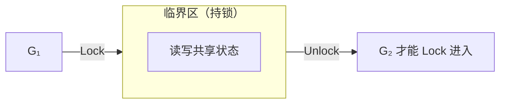

---

## 2. 临界区应该多窄？（与阿姆达尔同一条思路）

设计临界区时通常要同时考虑两件事：

| 目标 | 原因 |
|------|------|
| **尽量缩短持锁时间** | 持锁代码在效果上像 **串行段**：越长，其他 goroutine 越难并行推进，整体扩展性越接近 **阿姆达尔** 里「被串行比例钉死」的形态。 |
| **尽量少 `Lock/Unlock` 次数** | 每次加锁有 **固定成本**；若把逻辑切成「锁一行、放一下、再锁」，**调用次数**与 **缓存行为** 都会变差。 |

工程上是 **折中**：锁只包住 **「不加锁就会错」** 的最小更新；**HTTP、`ReadAll`、解析** 等慢操作放在锁外，锁内只做 **对共享 `slice` / map / 计数器** 等的几步更新。


---

## 3. `TryLock`（Go 1.18+）

`TryLock()`：锁空闲则获取并返回 `true`；已被占用则 **不阻塞**，立刻返回 `false`。适合极少数「**抢不到锁就改做别的事**」的路径。多数业务问题更宜用 **队列、单独 worker goroutine、或拆锁** 解决；`TryLock` 铺多了往往说明 **临界区划分或锁层次** 值得重新审视（可参考 `sync.Mutex` 文档中的讨论）。

---

## 4. `sync.RWMutex`：读锁与写锁的语义

### 4.1 规则（与「读写锁」名称对应）

| 锁类型 | API | 规则 |
|--------|-----|------|
| **读锁** | `RLock` / `RUnlock` | **可以多人同时读**：多个 goroutine 可同时持有读锁，在 **无写锁** 的前提下 **并发读** 同一受保护数据。 |
| **写锁** | `Lock` / `Unlock`（在 `RWMutex` 上表示写） | **同一时刻至多一个写者**；**写锁与所有读锁互斥**（**写的时候不能有读者**），写锁之间也 **互斥**。 |

与 **`Mutex`** 相比：`Mutex` 把读和写都当成「进临界区」；**`RWMutex`** 在读多写少、且 **读操作不破坏共享不变量** 时，能把 **读侧并行** 放开，只在 **写** 时全局互斥。若写很频繁，或读侧临界区极短，`RWMutex` 的额外逻辑未必划算，需用 **剖析（profiling）** 说话。

### 4.2 常见误区

- **「我只读，不用加锁」**：只要 **另有 goroutine 可能写同一内存**，无同步的并发读 **仍是 data race**。应 **`RLock` 下读**、或读 **拷贝 / 不可变快照 / 版本化视图**，不能默认「读天然安全」。
- **「读写锁一定更快」**：`RWMutex` 有自身成本；**读远多于写**、且读路径在锁内 **确实能并行放大** 时更值得考虑。读者/写者 **饥饿** 与 **公平性** 属于实现细节，关键路径应 **测**、必要时查 **`sync` 源码与 issue 讨论**。

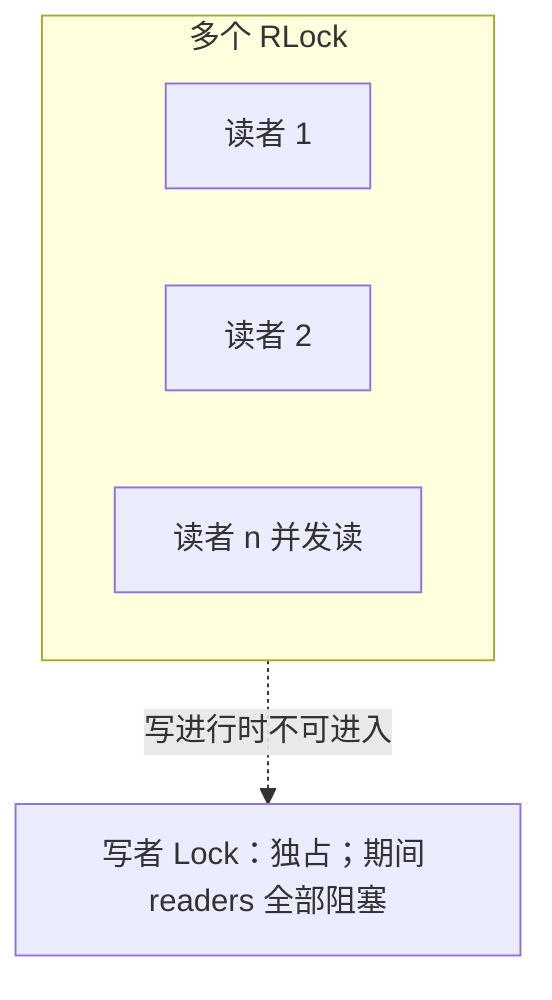

---

## 5. `WaitGroup`、持锁调用与 slice 增长

| 主题 | 说明 |
|------|------|
| **`WaitGroup`** | **`Add` 与 `Done` 必须配对**：`Add` 在启动 goroutine **之前**、`Done` 用 `defer`；顺序错了会 **panic** 或 **`Wait` 永远等不到**。详细语义、`happens-before`、Go 1.25 的 `wg.Go` 见 **Chapter 6 §1**。 |
| **持锁调用回调** | 持锁时调用 **未知实现**（接口方法、插件、RPC）容易 **死锁**（对方再锁你）或 **拖长临界区**；持锁路径应 **短、可审、少嵌套**。 |
| **`append` 与 slice 头** | `append` 可能分配 **新底层数组**；若把 `[]T` **按值**传进 goroutine 再 `append`，调用方可能 **看不到增长**。共享切片应通过 **结构体字段、`*[]T`、或 channel** 等明确所有权。 |

---

## 6. 与前一章的衔接

第三章说明 **为何需要同步** 以及 **数据竞争** 的定义；本章落到 **`Mutex` 的互斥语义**、**临界区长度与加锁频率的折中**，以及 **`RWMutex`**：**读锁允许多读者并发**，**写锁独占且与所有读互斥**（写时不能有读者）。动手时可对照 **`cmd/11-rwlock-readers-writer-demo`**（标准库）与 **`cmd/12-rwmutex-from-scratch`**（自拼语义）的打印顺序。

---

# Chapter 5：`sync.Cond` 与信号量 — 在互斥之上等待「条件成立」

**本章主线**：**`Mutex`** 只保证互斥；**`Cond`** 在 **持锁** 前提下 **阻塞并让出锁**，用 **`Signal` / `Broadcast`** 在 **同样持锁** 的路径上协作。**计数信号量** 用非负整数 **`permits`** 表达「还剩几个名额 / 已积压几条信用」：**`Acquire` 消费一次（不够就等），`Release` 归还或发放一次**。特别地，**初值 `permits = 0`** 时，**`Release` 与 `Acquire` 的先后顺序不必与 goroutine 启动顺序一致**——**先 `Release` 后 `Acquire`** 只是把 **信用先记入计数**，后到的 `Acquire` 照样能扣到；**先 `Acquire`** 则阻塞，直到别处 **`Release`**。这与 **无缓冲 channel**「必须收发双方同时就绪」的时序压力 **不是同一类问题**。

**本章摘要**

| 主题 | 说明 |
|------|------|
| **`sync.Cond`** | 与 **`Locker`**（多为 `Mutex`）绑定；**`Wait` / `Signal` / `Broadcast` 须在持 `c.L` 时调用**（[Cond](https://pkg.go.dev/sync#Cond)）。 |
| **`Wait`** | 调用前 **已持锁**；内部 **释放锁并睡眠**；返回时 **再次持锁**。 |
| **`Signal` / `Broadcast`** | 唤醒一个或全部等待者；在 **更新完共享条件** 之后、**仍持锁** 时调用，降低 **丢信号** 风险。 |
| **用 `for` 不用 `if`** | 被唤醒 **≠** 谓词已为真；用 **`for !pred() { c.Wait() }`** 重检不变量。 |
| **丢信号** | 无互斥或 waiter 未 `Wait` 时发信号，可能 **丢**；典型修法是 **锁 + 条件 + 在锁内 Signal**。 |
| **写饥饿** | **读、写共抢一把 `Mutex`** 且读极频时，写者 **长期进不去**；**`RWMutex`** 用读写分离与实现策略 **缓解**。 |
| **写偏好（`Cond`）** | 用 **计数 + `Cond`** 显式写「有写者等待则读者阻塞」；见 **`cmd/16`**。 |
| **信号量（一般）** | **`permits = N`**：最多 **N** 个并发进入某段逻辑（**限流**）。 |
| **`permits = 0` 与次序** | **`Release` 可先可后**：计数是 **全局账本**，先加后减与先减（阻塞）再加都合法；**不依赖**「谁先启动 goroutine」这种顺序。 |
| **生产库** | **[`golang.org/x/sync/semaphore`](https://pkg.go.dev/golang.org/x/sync/semaphore)**；教学自拼见 **`cmd/17`**。 |

---

## 1. `Mutex` 不够时：`Cond` 解决什么问题

互斥只解决 **「同一时刻谁进临界区」**；不表达 **「等到余额 ≥ 50 再扣款」** 这类 **条件**。若在临界区里用 **`for !cond { }` 空转**，会占着锁还烧 CPU。`Cond` 让等待方 **暂时离开锁、进入睡眠**，把 CPU 让给别人；条件可能被满足时，由修改共享状态的一方 **`Signal` / `Broadcast`**，等待方醒来后 **在同一把锁保护下重读状态**。

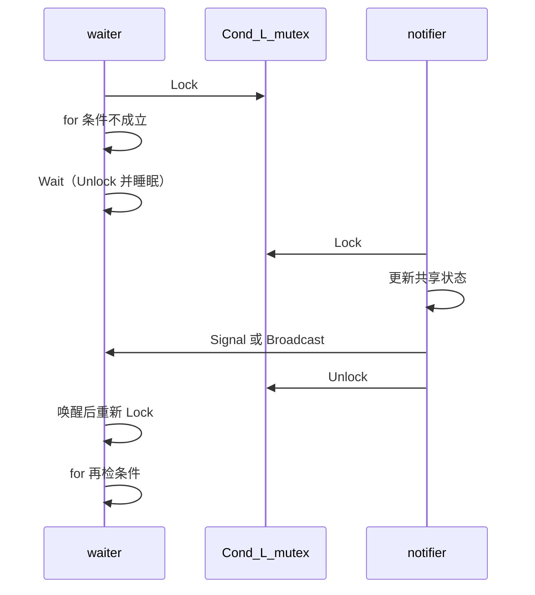

---

## 2. API 契约（与 `sync.Cond` 文档一致）

- **`sync.NewCond(l sync.Locker)`**：`l` 几乎总是 **`&sync.Mutex{}`**；`c.L` 即该 `Locker`。
- **`c.Wait()`**：调用前 **必须已 `c.L.Lock()`**；`Wait` 返回时 **已重新持有 `c.L`**。
- **`c.Signal()` / `c.Broadcast()`**：**在持有 `c.L` 时调用**，且通常 **在更新完「等待方所等的那部分共享状态」之后** 调用，避免 **丢信号** 与 **数据竞争**。

---

## 3. 为什么用 `for`，而不是 `if`

从 `Wait` 返回 **只说明「有人让你再检查一次」**，不保证 **你关心的布尔条件已经为真**。原因包括：**虚假唤醒**、多个 waiter 被 **`Broadcast`** 同时唤醒后 **只有一个该前进**、以及唤醒与再次检查之间 **又有第三个 goroutine 改了状态**。因此模式几乎是固定的：

```go
c.L.Lock()
for !ready() { // 或 for amount < threshold 等
    c.Wait()
}
// 此时在锁内，且 ready() 为真，再改状态
c.L.Unlock()
```

---

## 4. `Broadcast` 与 `Signal` 怎么选

- **`Signal`**：只有一个等待者会从当前状态变化中受益（典型 **生产者–消费者** 队列非空时唤醒一个消费者）。
- **`Broadcast`**：条件变化后 **多个等待者** 各自需要 **重新判断自己的谓词**（例如 **「所有玩家到齐」** 后，每个 goroutine 都要退出「等人」循环）。

### 4.1 `Cond` 与 `channel` 何时更顺手

**`channel`** 适合表达 **所有权传递、流水线、取消（`context`）** 等「**数据或控制流在 goroutine 之间流动**」的模型。**`Cond`** 适合 **已有一把锁保护的结构体**，在 **不变量暂时不成立** 时要 **阻塞并让出 CPU**，且唤醒方 **也在同一把锁下改同一批字段**。二者可同库共存：例如 **外层用 `Mutex+Cond` 维护复杂状态**，边界上仍用 **channel 与外部世界交互**。

---

## 5. 写饥饿、`RWMutex`、以及用 `Cond` 做写偏好

**现象**：若 **读、写都争用同一把 `Mutex`**，而 **读临界区短、调用极频**，则锁常在读者之间传递，**写者长期拿不到锁**，称为 **写饥饿**（与第四章「读锁多人并发」不是同一模型：那是 **`RWMutex` 已区分读写**）。

**标准库 `sync.RWMutex`**：把 **读** 与 **写** 分开；**写者在等待时**，实现会限制 **新来的读者** 与写者抢锁，从而 **缓解** 写饥饿（细节以 **当前 Go 版本实现** 为准）。

**自实现写偏好**：在 **`RWMutex` 出现之前或需要额外策略** 时，可用 **`readersCounter` / `writersWaiting` / `writerActive` + `Cond` + `for` 循环** 表达「有写者等待则读者在 `ReadLock` 里阻塞」等规则；复杂度与正确性成本都高，**默认仍应优先标准库**。

---

## 6. 信号量：计数、`permits = N` 限流、与 `permits = 0` 的次序

### 6.1 计数在表示什么

把信号量想成 **非负整数 `permits`**（在互斥或 `Cond` 保护下维护）：

- **`Acquire()`**：若 `permits > 0`，则 **`permits--`** 并返回；若 **`permits == 0`**，则 **阻塞**（内部等价于「等到 `permits` 变成正数再减」）。
- **`Release()`**：**`permits++`**，并 **唤醒** 可能在等的 `Acquire`。

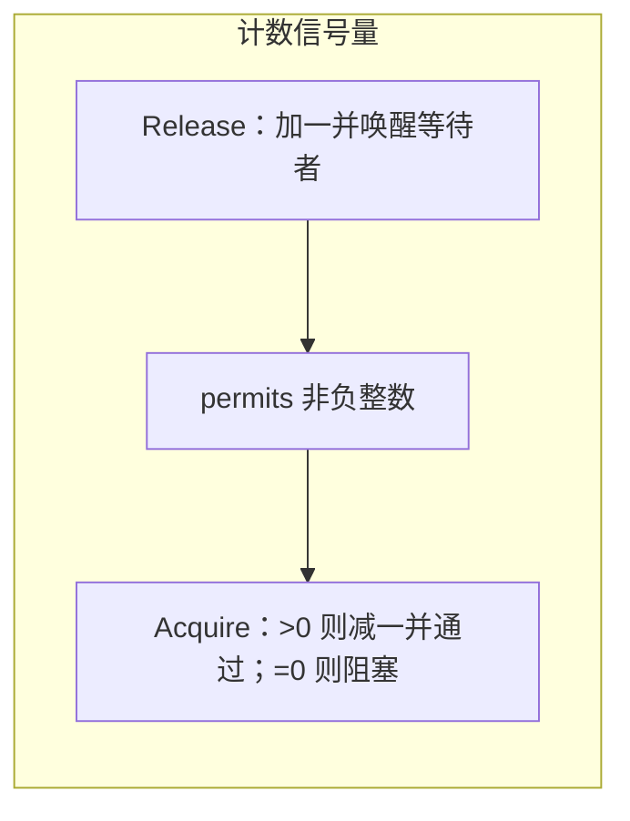

### 6.2 `permits = N`：限流（槽位）

初值 **`permits = N`** 时，**最多 N 个** goroutine 能「同时通过」`Acquire` 进入某段受保护逻辑（例如限制对下游 HTTP、DB 的并发）。每完成一段工作可 **`Release`** 归还一个槽位，或 **`defer Release()`** 在退出路径上归还。

### 6.3 `permits = 0`：完成记账——**先 `Release` 还是先 `Acquire` 无所谓**

初值 **`permits = 0`** 时，语义是：**当前没有预存槽位，但允许通过 `Release` 先「记账」**。因此：

- **工作 goroutine 先 `Release`、主 goroutine 后 `Acquire`**：每次 `Release` 把 **`permits` 加 1**；主 goroutine 的 `Acquire` 只是 **消费已存在的信用**，**完全合法**。不存在「必须先有人等在 `Acquire` 上，`Release` 才有效」这种要求。
- **主 goroutine 先 `Acquire`、工作 goroutine 后 `Release`**：第一个 `Acquire` 看到 **`permits == 0`** 会 **阻塞**，直到某个 `Release` 把计数推到正数——这也是常见写法。

**要点一句话**：**次序由「谁先需要消费 / 谁先产生信用」决定，不由语言强制**；与 **无缓冲 channel** 那种「发送与接收要同时配合才能完成一次握手」的 **同步点** 不同，信号量这里是 **异步计数账本**。

**对照（完成 N 件异步事）**：

| 方式 | 时序特点 |
|------|----------|
| **`sync.WaitGroup`** | 通常 **`Add(N)`** 在前，每个任务 **`Done()`**；`Wait` 等计数归零，**API 约束**更明确。 |
| **无缓冲 `chan struct{}`** | 常见模式是 **接收方先等、发送方后关** 等，**容易在「谁先」上写死**。 |
| **`Semaphore(0)` + N 次 `Release` / N 次 `Acquire`** | **`Release` 可早于对应的 `Acquire` 发生**；计数把 **「已完成」** 先存起来，**后到的 `Acquire` 照样扣账**。 |

示意（逻辑片段，非完整程序）：

```go
// 次序 A：子任务先 Release，主流程后 Acquire（与 cmd/17 同思路）
sem := NewSemaphore(0)
go func() { work(); sem.Release() }() // 先记账：permits 变为 1
sem.Acquire() // 后消费：permits 回到 0，不阻塞

// 次序 B：主流程先 Acquire，子任务后 Release（常见「等完成」）
sem := NewSemaphore(0)
go func() { work(); sem.Release() }()
sem.Acquire() // 若子任务尚未 Release，此处阻塞直到有信用
```

只要 **`Release` 总次数** 与 **`Acquire` 总次数** 在逻辑上匹配（例如各 **N** 次完成 **N** 个任务），**谁先谁后** 可以在单条边上任意交错，**不会出现「少一次 Release 就永远死锁」以外的顺序禁忌**（死锁仍可能来自 **Acquire 等不到足够的 Release**，那是 **计数配错** 而不是 **先后语法错误**）。

### 6.4 与 `Cond` 的关系、以及生产代码

用 **`sync.Cond` + `permits` + `for permits<=0 { Wait() }`** 可以 **自拼** 出上述语义，便于理解 **`x/sync/semaphore`** 内部也在解决同类问题。生产环境优先使用 **[`golang.org/x/sync/semaphore`](https://pkg.go.dev/golang.org/x/sync/semaphore)**（带 **context**、与调度集成更好）；本地教学见 **`cmd/17-semaphore-from-cond`**。

---

## 7. 与前后章节的衔接

- **第 4 章**讲了 **互斥与读写锁的语义**；本章在此基础上加入 **「在互斥保护的不变量上阻塞与唤醒」**（**`Cond`**），以及 **「用计数表达并发槽位与完成信号」**（**信号量**）。写偏好读写锁是 **`Cond` + 计数状态** 的典型组合题，读懂 `cmd/16` 有助于理解标准库 `RWMutex` 要解决的矛盾。
- **第 6 章**会把 `Cond` / 信号量这些底层原语**组装**成三种常见「等待」场景——**收尾**（`WaitGroup`）、**记账**（`Semaphore(0)`）、**汇合**（`Barrier`），并讨论为什么 Barrier 必须引入 **generation（分代）**。

---

<details>
<summary><strong>可选附录</strong>：仓库 <code>cmd/</code> 示例与命令（读笔记时可跳过）</summary>

与正文独立；示例在 **`cmd/`** 各子目录。

| 目录 | 说明 |
|------|------|
| `cmd/01-sequential` | 串行「假工作」 |
| `cmd/02-goroutines-sleep` | `Sleep` 等 goroutine（反例） |
| `cmd/03-goroutines-waitgroup` | `WaitGroup` 正例 |
| `cmd/04-racy-counter` | 故意竞态 + `-race` |
| `cmd/05-mutex-counter` | `mutex` 修正计数器 |
| `cmd/06-countdown-shared` | 共享 `count` + Sleep 轮询（演示用） |
| `cmd/07-bank-race` | 两 goroutine 改 `balance`，有竞态 |
| `cmd/08-bank-mutex` | 同上，`mutex` 保护读改写 |
| `cmd/09-rfc-freq-mutex` | 多 goroutine 拉 RFC，**锁仅包住对 `freq` 的写**（需外网） |
| `cmd/10-events-rwmutex` | **`RWMutex`**：写事件 + 多读快照 |
| `cmd/11-rwlock-readers-writer-demo` | **`sync.RWMutex`**：多读者 + 写者独占；打印顺序可看 **写等读放、读后写** |
| `cmd/12-rwmutex-from-scratch` | **两把 `Mutex` 拼读写锁**（教学实现，非 `sync` 源码）；与标准库对照 |
| `cmd/13-cond-bank-stingy-spendy` | **`sync.Cond`**：存款/取款在余额门槛上 **`Wait` / `Signal`** |
| `cmd/14-cond-wait-loop` | 父 goroutine **`for` + `Wait`** 依次等子任务 |
| `cmd/15-cond-broadcast-players` | **`Broadcast`**：人到齐后全员继续 |
| `cmd/16-rwmutex-write-prefer-cond` | **`Cond` 实现写偏好**读写锁（教学） |
| `cmd/17-semaphore-from-cond` | **`Cond` 拼计数信号量**；`permits=0` 与完成计数 |
| `cmd/18-waitgroup-basic` | **`sync.WaitGroup`** 基本收尾同步（`Add`/`Done`/`Wait`） |
| `cmd/19-waitgroup-file-search` | 递归文件搜索：goroutine 内部 **动态 `Add`**；用法 `go run ./cmd/19-waitgroup-file-search <dir> <substring>` |
| `cmd/20-waitgroup-from-cond` | **`Mutex + Cond` 自拼** 动态 WaitGroup（归零 `Broadcast`） |
| `cmd/21-barrier-reusable` | **可复用 Barrier**：带 **generation** 分代，避免跨轮串台 |
| `cmd/22-barrier-matrix` | 多轮矩阵乘法：**两道 Barrier**（放行计算 / 等汇合）驱动 |
| `cmd/23-channel-sync-sentinel` | **同步 channel + STOP 哨兵**：默认同步语义；主 goroutine 退出抢跑的典型反面 |
| `cmd/24-channel-send-deadlock` | 反例：**发送方等不到接收者** → 运行时 deadlock |
| `cmd/25-channel-recv-deadlock` | 反例：**接收方等不到发送者** → 运行时 deadlock |
| `cmd/26-channel-buffered` | **带 buffer 的 channel**：buffer=3 观察发送 / 接收错位 |
| `cmd/27-channel-direction` | **方向限定**：只写 `chan<-` / 只读 `<-chan` 形参 |
| `cmd/28-channel-close-ok` | `close(ch)` + **`msg, ok := <-ch`**：取代哨兵值 |
| `cmd/29-channel-range` | **`for msg := range ch`**：close + ok 的语法糖 |
| `cmd/30-channel-result` | **用 channel 回收 goroutine 返回值**（CSP 版 future） |
| `cmd/31-close-as-broadcast` | `close(done)` 一次性唤醒所有监听者——`ctx.Done()` 的底层形态 |

**运行方式**：在 `note-01` 根目录执行 `go run ./cmd/<name>`，全量构建用 `go build ./...`。

- **Ch3 / 竞态检测**：`go run -race ./cmd/07-bank-race`（几乎必复现丢失更新）。
- **Ch4 / 读写锁**：`go run ./cmd/11-rwlock-readers-writer-demo`、`go run ./cmd/12-rwmutex-from-scratch`。
- **Ch5 / `Cond` 与信号量**：`go run ./cmd/13-cond-bank-stingy-spendy`、`go run ./cmd/16-rwmutex-write-prefer-cond`、`go run ./cmd/17-semaphore-from-cond`。
- **Ch6 / 收尾·记账·汇合**：`go run ./cmd/18-waitgroup-basic`、`go run ./cmd/19-waitgroup-file-search . main`、`go run ./cmd/22-barrier-matrix`。
- **Ch7 / channel 语义**：`go run ./cmd/26-channel-buffered`、`go run ./cmd/28-channel-close-ok`、`go run ./cmd/29-channel-range`、`go run ./cmd/30-channel-result`、`go run ./cmd/31-close-as-broadcast`；**预期 deadlock 反例**：`go run ./cmd/24-channel-send-deadlock`、`go run ./cmd/25-channel-recv-deadlock`。

</details>

# Chapter 6：`WaitGroup`、`Semaphore(0)`、`Barrier` — 收尾、记账、汇合

**本章主线**：三者都是在「等」，但等的**事件形状**不同：**`WaitGroup`** 等「一组任务整组收尾」；**`Semaphore(0)`** 把每次「完成」记成一笔**信用**，`Acquire` 可以先发生也可以后发生；**`Barrier`** 等「一轮里的**所有参与者**都到达卡点」，然后同批放行。三者都能用来「等 N 件异步事」，真正的区别是 **同步点位置、谁会阻塞、是否可复用**，以及**能否观察「第 k 件完成」**。

**本章摘要**

| 原语 | 计数含义 | 谁会阻塞 | 同步点位置 | 复用性 | happens-before |
|------|----------|----------|------------|--------|----------------|
| **`sync.WaitGroup`** | 还剩多少任务未完成 | 调 `Wait()` 的一方 | 任务**末尾** | **单轮**为主（归零后可再 `Add` 复用，需避开 race）| `Done` **hb** 对应 `Wait` 返回 |
| **`Semaphore(N)` / `(0)`** | 已积累的「信用 / 空槽位」数 | 先到的 `Acquire()` | **任意位置**（业务自定）| **天然可复用**（一本长流水账）| `Release` **hb** 对应的 `Acquire` 返回 |
| **`Barrier`**（自实现）| 本轮还差几人到齐 | **所有参与者** | 任务**中途**（phase boundary）| 需 **generation 分代** 才能循环 | 最后到达者的写 **hb** 其他人 `Wait` 返回 |

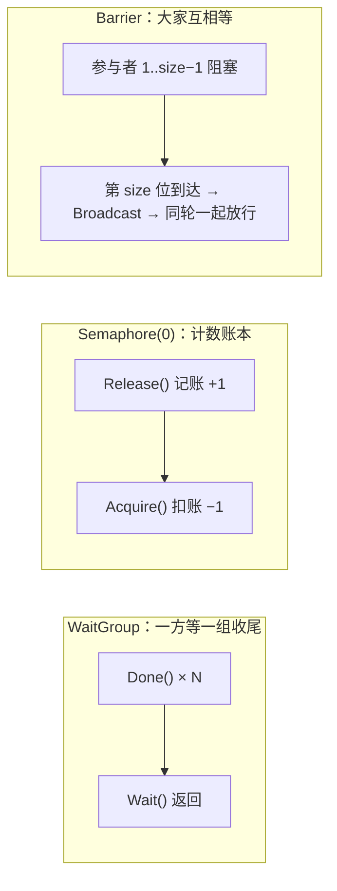

---

## 1. `sync.WaitGroup`：最常用的「收尾同步」

### 1.1 语义与 happens-before

`WaitGroup` 内部只有一个非负计数器，API 三个：

- **`Add(delta int)`**：计数 **+delta**（允许负数，但**不得**让计数变成负值，否则 panic）。
- **`Done()`**：等价于 `Add(-1)`。
- **`Wait()`**：阻塞到计数归零后返回；此后仍可再 `Add`、再 `Wait`，**前提是要等上一次 `Wait` 真的返回**（见下文坑）。

**内存模型**：[Go Memory Model # waitgroup](https://go.dev/ref/mem#waitgroup) 规定，**所有 `Done` 调用** **happens before** 任意被解除阻塞的 **`Wait` 返回**——这就是「在 goroutine 里写的共享状态，`Wait` 之后读取是安全的」的语言级保证。

### 1.2 正确使用模式

```go
var wg sync.WaitGroup
for i := 0; i < n; i++ {
    wg.Add(1) // 在启动 goroutine 之前 Add
    go func() {
        defer wg.Done()
        doWork()
    }()
}
wg.Wait()
```

要点：

- **`Add` 在启动前**、**`Done` 在 `defer`**：避免两类竞态（见 1.3）。
- **一次 `Add(n)` 比循环 `Add(1)` 省锁**；后者更灵活（允许中途生成任务）。
- 计数**归零后**可以重用同一把 `WaitGroup`，但「新一轮 `Add`」必须**发生在上一次 `Wait` 返回之后**；否则 `Wait` 还在等时并发 `Add` 是 race。

### 1.3 常见坑

| 反例 | 症状 | 修法 |
|------|------|------|
| `go func(){ wg.Add(1); defer wg.Done(); … }()` | `Wait` 可能赶在 `Add` 之前看到 0，**提前返回** | 先 `Add` 再 `go` |
| 某分支提前 `return` 忘了 `Done` | `Wait` **永久阻塞** | 统一用 `defer wg.Done()` |
| 把 `WaitGroup` 当「中途汇合」 | 多阶段场景写起来别扭、易错 | 改用 `Barrier`（见 §3）或 channel |
| `Add(-k)` 把计数推到负数 | **panic** | 用 `Done`；避免手写负数 |
| `func f(wg sync.WaitGroup){}`（按值传递）| `Done` 加在副本上，外层永远等 | 传 `*sync.WaitGroup` |
| 在 `Wait` 还在等时并发 `Add` | race，行为未定义 | 用额外同步点把「新一轮 `Add`」排在 `Wait` 返回之后 |

### 1.4 Go 1.25+：`WaitGroup.Go`

Go 1.25 为 `sync.WaitGroup` 新增便捷方法 `wg.Go(f func())`：内部把 **`Add(1)` + 启动 goroutine + `defer Done()`** 原子地打包在一处，从源头规避 1.3 里「`Add` 放进 goroutine」那类顺序坑：

```go
var wg sync.WaitGroup
for i := 0; i < n; i++ {
    wg.Go(func() { doWork() })
}
wg.Wait()
```

若工具链仍在 1.24 或更早，继续用三段式写法，语义等价。

---

## 2. `Semaphore(0)`：把「完成」当作可累积信用

第 5 章已经把信号量定义成**非负整数 `permits`** 上的 `Acquire` / `Release`。本节重点把它与 `WaitGroup` 与无缓冲 channel **并排对照**，说清楚 **「为什么 `permits=0` 做完成记账时，先 `Release` 和先 `Acquire` 都合法」**。

### 2.1 为什么「先 `Release`」合法：信号量是**异步账本**

把 `permits` 想成一本小账本：

- **`Release()`**：账本 **+1**，顺手叫醒一个可能在等的 `Acquire`。
- **`Acquire()`**：账本 **> 0** 则 **−1** 通过；**= 0** 则挂起到账本再变正。

因此 **「先 `Release` 后 `Acquire`」** 不会丢信用：`Release` 把 `permits` 从 0 推到 1，后到的 `Acquire` 看到正数直接扣减通过；**「先 `Acquire` 后 `Release`」** 则是 `Acquire` 先挂起，`Release` 再唤醒它。两种顺序都对。

这与**无缓冲 channel** 的同步点语义**不同**：`ch <- v` 与 `<-ch` 必须**同时就绪**才能完成一次握手，没人收则发送方一直挂着；计数式信号量不存在这种「同时就绪」要求。

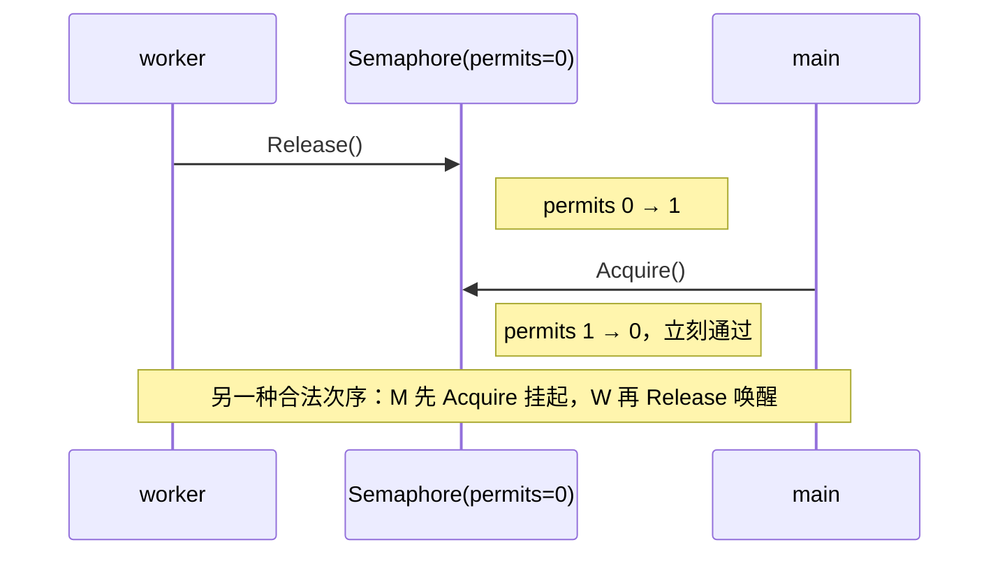

### 2.2 完成 N 件异步事：三种写法对照

| 原语 | 典型写法 | 优势 | 限制 |
|------|----------|------|------|
| `sync.WaitGroup` | `Add(N)` → 每任务 `Done()` → `Wait()` | API 直接、内存模型清晰、最易读 | 只能「等整组」，看不到「第 k 件完成」 |
| `Semaphore(0)` | 每任务 `Release()` → 主流程循环 `Acquire()` N 次 | 把「完成」**摊成可逐个消费的事件**（进度条、`select` 合流）| 计数要自己数对，写错易死锁 |
| 无缓冲 `chan T` | 任务 `ch <- r` → 主流程收 N 次 | 能把**结果**一起传出来 | 发送方必须「等到有人收」才能继续 |

选型直觉：**只想等收尾**就 `WaitGroup`；**想把「完成」当事件流**就 `Semaphore(0)` 或 `chan`；**想顺带带结果 / 带错**就 channel（或后续的 `errgroup`）。

### 2.3 `permits = N`：同一把原语的另一面——限流

初值 `permits = N` 是**槽位**语义：最多 **N 个** goroutine 同时通过 `Acquire` 进入受保护段，`Release`（配 `defer`）归还槽位。典型场景：限制对下游 HTTP / DB / 文件句柄的并发度。**生产环境优先** [`golang.org/x/sync/semaphore`](https://pkg.go.dev/golang.org/x/sync/semaphore)（带 `context`、能被取消，与调度集成更好）；自拼教学版见 `cmd/17-semaphore-from-cond`。

**一句话**：`permits = N` 是「最多 N 人同时干」；`permits = 0` 是「每干完一件记一笔账，谁想消费谁去 `Acquire`」——同一把原语的**槽位**与**信用**两面。

---

## 3. `Barrier`：中途卡点「全员到齐再一起走」

### 3.1 语义与最小模型

给定固定的 **参与者数 `size`**。每个参与者在某个同步点调用 `b.Wait()`：

- 第 1..size−1 个到达者：**阻塞**。
- 第 `size` 个到达者：本轮凑齐，负责 **`Broadcast`** 叫醒全体，大家**同时**从 `Wait` 返回进入下一阶段。

**与 `WaitGroup` 最本质的区别**：`WaitGroup` 是「**一方**在外面等一组人完成」；`Barrier` 是「**大家互相等自己人**」。

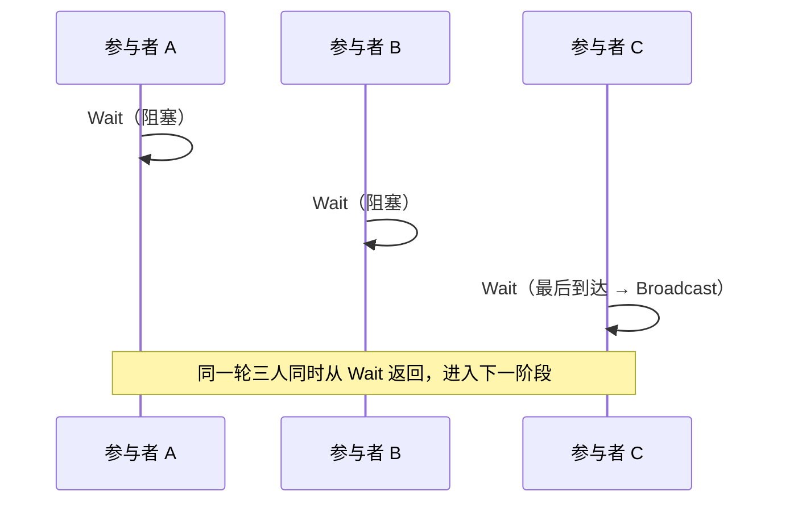

### 3.2 Go 标准库现状

Go 标准库**没有** `sync.Barrier`；`Mutex + Cond` 自拼最直观。若只要一次性栅栏，用 `chan struct{}` 也能模拟。

易混淆邻居：[`golang.org/x/sync/errgroup`](https://pkg.go.dev/golang.org/x/sync/errgroup) 侧重「**一组任务 + 错误传播 + `context` 取消**」，语义更接近 `WaitGroup`，**不是** barrier。

### 3.3 为什么必须有 **generation（分代）**：可复用 Barrier 的关键陷阱

朴素写法——只维护 `waitCount`：

```go
// 错：看起来对，但无法安全复用
func (b *Barrier) Wait() {
    b.mu.Lock()
    b.waitCount++
    if b.waitCount == b.size {
        b.waitCount = 0
        b.cond.Broadcast()
    } else {
        for b.waitCount != 0 { // 用这一条判断「是否已放行」
            b.cond.Wait()
        }
    }
    b.mu.Unlock()
}
```

**失败路径**：

1. 第 1 轮最后一人到达：`waitCount = 0`，`Broadcast`。
2. 被叫醒的等待者还没得到 CPU 检查谓词；有个**跑得快**的参与者**已经进入第 2 轮**并调用 `Wait`：`waitCount++` 让它变成 `1`。
3. 第 1 轮里尚未醒的那几个这时终于再检查，看到 `waitCount != 0`，以为「还没齐」继续 `Wait`——被**下一轮的计数**骗住，可能永远醒不来。

**修法：再加一个 `generation`（轮次号）**，每个参与者记下进入时的 `myGen`，**只比 generation 是否推进**；最后到达者负责 `generation++ + Broadcast`：

```go
func (b *Barrier) Wait() {
    b.mu.Lock()
    defer b.mu.Unlock()

    myGen := b.generation
    b.waitCount++
    if b.waitCount == b.size {
        b.waitCount = 0
        b.generation++
        b.cond.Broadcast()
        return
    }
    for myGen == b.generation {
        b.cond.Wait()
    }
}
```

这样「跑得快的参与者进入下一轮」**不会污染**上一轮等待者的唤醒判定——`myGen` 是各自的时间戳，只关心轮次是否已经前进一格。完整实现见 `cmd/21-barrier-reusable`；多轮矩阵乘法见 `cmd/22-barrier-matrix`。

### 3.4 何时值得用 Barrier

- **迭代式并行算法 / BSP 批同步**：每轮各工人算自己那份，轮末**必须同步一次**才能进入下一轮（矩阵乘法、有限差分、物理仿真步进、回合制模拟）。
- **参与者数量固定**、**阶段边界清晰**、对齐推进对正确性至关重要。
- 反面：**只是「等所有任务结束」一次**用 `WaitGroup` 就够，不必上 Barrier。

---

## 4. 三原语互相能替代吗：决策表

| 需求 | 首选 | 次选 / 兼容写法 |
|------|------|-----------------|
| 等一组 goroutine 全部结束 | `sync.WaitGroup`（Go 1.25+ 可用 `wg.Go`）| `chan` 收 N 次；N 次 `Semaphore.Acquire` |
| 限并发到 N（限流）| [`x/sync/semaphore.Weighted`](https://pkg.go.dev/golang.org/x/sync/semaphore) | 自拼 `Semaphore(N)`；带 buffer 的 `chan struct{}` |
| 把「完成」摊成可逐个消费的事件 | `Semaphore(0)` 或 `chan T` | `WaitGroup` 做不到单点观察 |
| 多阶段、多参与者的卡点同步 | 自实现 **分代 `Barrier`** | N×N 次 `Release`/`Acquire` 手工拼凑；两阶段 `chan` |
| 一组任务带错误传播、带 `context` | [`x/sync/errgroup.Group`](https://pkg.go.dev/golang.org/x/sync/errgroup) | `WaitGroup` + `atomic` / `mutex` 自收错 |
| 扇出 → 扇入、带数据流 | `chan`（可配 `select` / `context`）| `WaitGroup` + 共享结果结构 |

**一句话速记**：**`WaitGroup` 等收尾，`Semaphore` 记账，`Barrier` 等汇合，`errgroup` 等收尾带错**。

---

## 5. 与 Chapter 5 的衔接

第 5 章把 **`Cond`** 与 **计数信号量** 的底层讲清楚：**阻塞 / 唤醒** 与 **计数账本**。本章把它们组装成三种常见的「等待」场景——**收尾**、**记账**、**汇合**，并点出：

1. **`WaitGroup` 的 happens-before** 保证为何是「并发写 → 主流程安全读」的默认同步手段。
2. **`Semaphore(0)`** 为什么**不依赖**「谁先发生」，本质是一本异步账本，与无缓冲 channel 的同步点语义**不同**。
3. **`Barrier` 的 generation** 为什么**必须**有，否则跨轮就会串台——典型 `Cond` 谓词设计题。

真实工程里这几种经常混用：一个主流程可能用 `errgroup` 收尾 + 用 `semaphore` 限流 + 在某个热点数据结构上用 `Cond` 等不变量。**选型按「等的是什么形状的事件」**来想，而不是按原语名字硬套。

---

# Chapter 7：CSP 与 channel — 通过通信共享数据

**本章主线**：从前六章的「**共享内存 + 同步原语**」正式切到 **CSP（Communicating Sequential Processes）**：goroutine 之间通过 **channel** **收发消息** 来协作，**消息本身** 就在内存模型里建立 **happens-before**。默认 channel **同步**，一次成功的收发相当于一次 **握手**；加 buffer 变成 **有界队列**；方向限定在 **编译期** 收窄能力；`close` 取代旧式 **哨兵值 / poison pill**；`for range` 是 `close + ok` 的语法糖；goroutine 结果常以 channel 回收。

**本章摘要**

| 主题 | 说明 |
|------|------|
| CSP | **不共享变量，通过通信共享数据**；消息本身自带 happens-before |
| 同步 channel | `make(chan T)`：**收发必须同时就绪**，任一侧缺席 → **deadlock** |
| 缓冲 channel | `make(chan T, N)`：**buffer 未满** 才不阻塞发送；**为空** 时接收阻塞；是 **有界队列**，不是无限邮箱 |
| 方向 | 形参 `chan<- T` 只写、`<-chan T` 只读；**编译期** 收窄能力 |
| close | `close(ch)` 表示「**不会再有新消息**」；**只发送方关**；重复关或关 nil 会 panic |
| 读已关 channel | 缓冲排空后立即返回 **零值 + `ok=false`**；用 `msg, ok := <-ch` 或 `for range ch` 判定 |
| Sentinel / poison pill | 用特殊值示意终止；容易和业务值冲突，**`close` 是它的语言级等价品** |
| 函数结果回收 | `resCh := make(chan T); go func(){ resCh <- f() }(); <-resCh`（CSP 版 future） |
| close 作广播 | `close(done)` 一次性唤醒 **所有** 在 `<-done` 上阻塞的接收者；**`ctx.Done()` 内部就是这一套** |
| nil channel | **零值是 nil**；在 nil channel 上 **收 / 发都永远阻塞**，`close(nil)` 直接 panic |
| happens-before 精细 | **unbuffered**：receive **hb** send 完成之后的语句；**buffered(N)**：第 k 次 send **hb** 第 k 次 receive 完成 |
| goroutine 泄漏 | 发送方阻塞在没人收的 channel 上、或接收方永远等不到值 → **goroutine 回收不了**，内存 / fd 累积 |
| select 预告 | **Ch8 正题**：多路复用、`default` 非阻塞分支、`time.After` 超时、**`case`随机选** |
| Fairness | 多路就绪 `select` **随机** 选一条；调度层不承诺 channel 等待者 FIFO，**不要假设「先等的一定先醒」** |

---

## 1. 从共享内存到消息传递：换一套协作范式

前六章的主要工具是 **共享内存 + 同步原语**：`Mutex` 保不变量，`Cond` 在不变量上阻塞 / 唤醒，`WaitGroup` / 信号量做计数式收尾。CSP 换一个角度：**不让两个 goroutine 共享某块「谁都能改」的状态，而是让一个 goroutine「把消息交给」另一个 goroutine**。Go 的座右铭可以照抄：

> Don't communicate by sharing memory; share memory by communicating.

消息传递并不比共享内存「更高级」，只是**适合不同形状的问题**：

- **共享内存 + 锁**：对 **少量共享可变状态** 做 **不变量保护**（计数器、小缓存、读多写少的表）。
- **消息传递（channel）**：**数据 / 控制流在 goroutine 之间流动**（流水线、扇入扇出、任务分发、取消传播）。

在分布式系统里消息传递几乎是唯一选项——进程之间没有共享内存，只能走 **HTTP / gRPC / 队列**。单机上的 goroutine 与此同构：channel 让「进程间通信（IPC）/ 线程间通信（ITC）」都能用同一套心智模型表达。

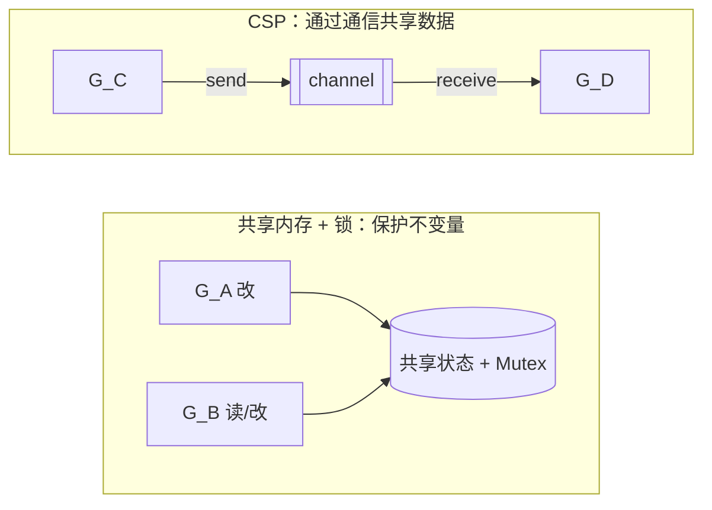

---

## 2. 默认同步的 channel：一次成功收发 = 一次握手

### 2.1 语义

`make(chan T)` 得到的是 **无缓冲 channel**：

- **发送方** `ch <- v`：阻塞，**直到** 有接收方执行 `<-ch`。
- **接收方** `<-ch`：阻塞，**直到** 有发送方执行 `ch <- v`。
- 一次成功收发是一次 **rendezvous（握手）**，语言规范规定 **send happens before the corresponding receive completes**（见 [Go Memory Model](https://go.dev/ref/mem#chan)）——**不需要** 再额外上锁来传递数据。

因此同步 channel **同时负责** 两件事：**传值** + **定序**；这也是为什么前面章节里凡是「等某个 goroutine 把事情做完再继续」的场景，用 `chan struct{}` 就够了。

### 2.2 一边缺席就 deadlock

把 channel 想成两头接水管：**只有两头都接好**，水才能流。任一端缺席，另一端就会一直等。最小反例：

```go
msgs := make(chan string)
go func() { time.Sleep(5 * time.Second) }() // 从不读
msgs <- "hi" // 永久阻塞：没有接收者
```

当运行时检测到 **所有 goroutine 都在睡眠**、没人能推进时，会直接终止进程：

```
fatal error: all goroutines are asleep - deadlock!
```

对称的反例（接收方等不到发送方）也一样会 deadlock。`cmd/24-channel-send-deadlock` 与 `cmd/25-channel-recv-deadlock` 就分别演示这两种情形。

### 2.3 哨兵值与 STOP：为什么等会被 `close` 取代

同步 channel 上常见的一种退出约定是 **约定一个特殊值** 让接收方结束循环——在并发 / 分布式语境里这叫 **sentinel value** 或 **poison pill**：

```go
msgs <- "HELLO"
msgs <- "WORLD"
msgs <- "STOP" // 哨兵：接收方看到它就退出 for 循环
```

可跑的完整版见 `cmd/23-channel-sync-sentinel`。这种写法能用，但两个缺点很明显：**哨兵值要从业务域里挑一个不会冲突的 magic value**；另外，**主 goroutine 发完 STOP 就 return**，接收方的最后一行打印可能来不及完成（主函数返回即进程退出，Ch3 §6 已经点过）。§5 会给出 Go 的等价机制 `close(ch)`。

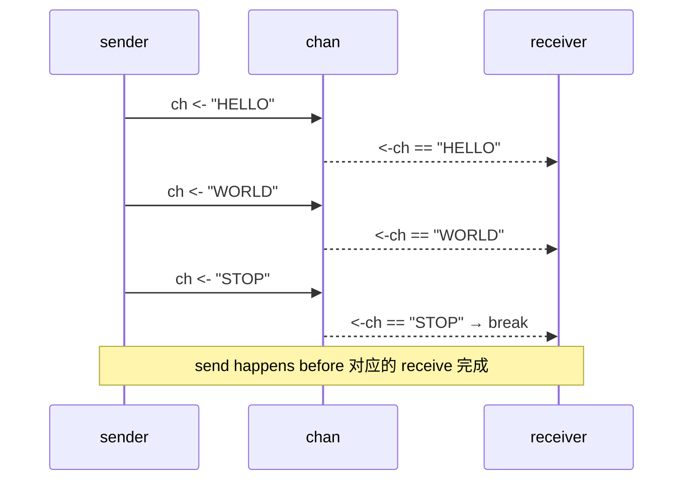

### 2.4 为什么默认同步：是设计选择，不是性能取舍

同步 channel 看起来「比带 buffer 的慢」，但默认同步有两条关键理由：

1. **天然背压（back-pressure）**：发送方被接收方的消费速度 **立刻** 顶回去——生产 > 消费时，生产者自己就慢下来，内存不会偷偷积压。加 buffer 等于在两者之间塞一个 **有界队列**，`buffer=N` 时只能顶 N 条的不均衡；buffer 越大，越像「先写进去再说」，**bug 就越容易拖到很久后才爆**。
2. **贴合 CSP 的「握手」模型**：一次成功收发就是 **一次同步点**，正好承担 Ch3 里强调的 **happens-before**。有 buffer 时这个同步点会挪位（见 §8.3），语义更绕。

**什么时候上 buffer**：消费端确实可以「偶尔慢一点」、且业务能容忍有限堆积——比如 **日志采集 / 任务分发** 的削峰。**不要** 把 buffer 当成「反正先发出去」的逃生口。

---

## 3. 带缓冲 channel：有界队列

`make(chan T, N)` 创建带 **容量 N** 的缓冲 channel：

- 发送方：只要 **`len(ch) < N`** 就 **不阻塞**，消息先躺在 buffer 里；buffer 满时退化回「等接收方消费一个」。
- 接收方：**`len(ch) > 0`** 时立即拿走一条；buffer 为空时退化回「等发送方送入一条」。
- `len(ch)` 读当前条数，`cap(ch)` 读容量；注意 `len(ch)` **只是瞬时快照**，别作为业务判断依据（读到的数立刻可能变）。

`cmd/26-channel-buffered` 里把 `buffer=3` 和一次塞 6 条 + 哨兵 `-1` 放在一起跑，可以直接看到 **发送方在 buffer 满时被压回**、**接收方拿走一条后发送方立刻继续** 的交错。

**buffer 不是万能**：

| 误解 | 实际 |
|------|------|
| 「加 buffer 就不会死锁」 | **错**。buffer 只推迟死锁——写入量 > 消费量时，满了照样阻塞；消费方退出，发送方一样卡死。 |
| 「buffer 越大越安全」 | 变相把问题掩盖成 **内存涨**、**延迟堆积**；应当配合 **限流 / 背压**。 |
| 「channel 可以当内存队列的直接替代」 | 语义上只是 **进程内、有界、FIFO** 的 goroutine 间队列；跨进程还得 **MQ / Kafka** 之类。 |

```mermaid
flowchart LR
  S["sender"] -->|send| buf[("buffer (cap=N)")]
  buf -->|receive| R["receiver"]
  note1["len==N → 发送阻塞"] -.-> buf
  note2["len==0 → 接收阻塞"] -.-> buf
```

---

## 4. channel 的方向：在形参上收窄能力

底层 channel 永远是双向的；但在 **函数签名** 里可以限定方向，编译器会把「只该读却去写」之类的错误挡在 **编译期**：

| 形参类型 | 含义 | 允许操作 |
|----------|------|----------|
| `chan T` | 双向 | 收、发、`close` |
| `chan<- T` | **只写** | `ch <- v`（不允许 `<-ch`） |
| `<-chan T` | **只读** | `<-ch`（不允许 `ch <- v`、不允许 `close`） |

```go
func sender(out chan<- int)   { out <- 1 }
func receiver(in <-chan int)  { _ = <-in }
```

调用点传入一个 `chan int` 时会 **自动窄化**；反向则不行（只读 channel 不能再当双向用）。这在写 **库函数 / 流水线 stage** 时特别有用：**stage 的输入声明成 `<-chan`、输出声明成 `chan<-`**，误把方向用反就编译不过。完整例见 `cmd/27-channel-direction`。

---

## 5. `close`：声明「不会再有新消息」

### 5.1 规则

- `close(ch)` **只在发送方** 调用；表示 **不会再发新消息**。
- **关闭后仍可接收**：buffer 里剩的会被依次读完；排空后，再读立即返回 **零值 + `ok=false`**。
- **向已关 channel 发送** → **panic: send on closed channel**。
- **重复关** 或 `close(nil)` → **panic**。
- **nil channel 上收发都永远阻塞**（常用于 `select` 里「暂时禁用某一路」）。

用 `msg, ok := <-ch` 可以区分「收到了一条值 `v`」和「channel 已关且排空」：

```go
for {
    msg, ok := <-ch
    if !ok {
        return
    }
    use(msg)
}
```

完整例见 `cmd/28-channel-close-ok`。

### 5.2 `close` 与 sentinel 的关系

sentinel / poison pill 本质是「**用一条消息的内容** 表达控制信号」。`close` 则是「**channel 自己** 的状态变化」，二者在目的上等价，但 `close` 有两点优势：

1. **不占用业务值域**：不必在 `int` 里挑一个「不可能」的值（`-1`？`MaxInt`？）。
2. **对「所有当前与未来的接收者** 都一次性生效**：多个 range 接收者会在 channel 排空时一起退出，用 sentinel 则每条只能唤醒一个。

**谁来关？** 约定俗成：**只有发送方** 关 channel；**接收方不要关**，否则很容易因为「另一路还在发」而命中 panic。多生产者的场景常再加一层 `WaitGroup`：所有生产者 `Done` 归零后，**单独一个 closer goroutine** 调用 `close`。

### 5.3 与 `context` 的关系（提前预告）

`context.Context` 的取消传播 **内部** 就是一个 `chan struct{}`：`ctx.Done()` 返回一个只读 channel，取消即 `close` 该 channel。**「close 是对所有接收者的广播」** 的性质被直接拿来做 **取消信号扩散**——这是 Go 取消模型最常见的底层形态。

### 5.4 `close` 作「一对多广播」

**普通发送只能唤醒一个接收者**：`ch <- v` 的值被 **某一个** `<-ch` 拿走，剩下的还在等。**但 `close(ch)` 会一次性解除所有正在 `<-ch` 上阻塞的接收者**——它们各自读到 **零值 + `ok=false`**。这正是 `ctx.Done()` 的工作机制：取消时不需要「数有几个监听者」，一条 close 就把所有人都叫醒。

常见写法是用 `chan struct{}`（零大小，不占额外内存，只传信号）作为 **done channel**：

```go
done := make(chan struct{})

for i := 0; i < n; i++ {
    go func() {
        <-done // 所有 worker 都阻塞在这一行
        // ... 清理并退出 ...
    }()
}

close(done) // 一次 close，全员同步唤醒
```

完整可运行例见 `cmd/31-close-as-broadcast`。

**为什么别用「发 N 条取消消息」来替代**：`n` 可能随时变化（动态加 worker）、或压根不知道有多少监听者；`close` 的广播语义和「订阅者数量」无关，这是它 **不可替代** 的地方。

---

## 6. `for range ch`：close + ok 的语法糖

```go
for msg := range ch {
    use(msg)
}
// channel 被 close 且排空后，range 自动退出
```

等价于手写 `for { msg, ok := <-ch; if !ok { break }; use(msg) }`。好处：

- **少写一行**；更重要的是，**不会忘记处理 `ok=false`**——不然容易写出一个无限读零值的循环。
- **配合 `close`** 天然表达 **「消费到数据流结束」**，非常适合流水线 stage 的输入侧。

完整例见 `cmd/29-channel-range`。

---

## 7. 用 channel 回收 goroutine 的返回值

Go 的 goroutine **没有返回值语法**（`go f()` 弃掉 `f` 的返回值）；要把 goroutine 的结果拿回来，最朴素的模式是让 goroutine **把结果写进 channel**：

```go
resCh := make(chan []int)
go func() { resCh <- findFactors(12345) }()

_ = findFactors(54321) // 主流程同时做别的
result := <-resCh      // 需要时再收
```

见 `cmd/30-channel-result`。相比「共享变量 + 锁」，这种写法的优点：

- **数据所有权** 随消息流动：子 goroutine 写进 channel 后就不再触碰结果，主流程收下即独占，避免共享。
- **send happens before receive** 自动建立可见性，不用自己上锁。
- **可扩展到多结果**：用 `chan Result` + N 次接收、或 buffer 恰好为 N 的 channel 配合 `close`，就能把「N 件结果」摊成可逐条消费的流，与 Ch6 §2 的 `Semaphore(0)` 是一个思路的两种表达。

生产代码里，如果还要带 **错误** 或 **取消**，往上叠 [`golang.org/x/sync/errgroup`](https://pkg.go.dev/golang.org/x/sync/errgroup) 就能直接拿到「一组 goroutine + error + context」。

---

## 8. 进阶要点：操作速查、nil channel、精细 happens-before、goroutine 泄漏

### 8.1 channel 操作速查表

| 操作 | nil channel | 空、未关闭 | 有值、未关闭 | 已关闭、空 | 已关闭、有值 |
|------|-------------|-----------|--------------|-----------|--------------|
| `ch <- v`（发送） | **永远阻塞** | 阻塞等接收者（unbuffered）/ 入 buffer（buffered 未满）| 同左（buffered 未满）/ 阻塞（满）| **panic**：send on closed channel | **panic** |
| `v := <-ch`（接收） | **永远阻塞** | 阻塞等发送者 | 立即取走一个值 | 立即返回 **零值 + `ok=false`** | 立即取走一个值；排空后变零值 |
| `close(ch)` | **panic**：close of nil channel | 成功；后续接收依上表 | 成功；buffer 里已存的仍可被读完 | **panic**：close of closed channel | **panic** |
| `len(ch)` / `cap(ch)` | 0 / 0 | 0 / cap | 0..cap / cap | 0 / cap | 0..cap / cap |

两个约束值得刻进肌肉记忆：**关 channel 只由发送方做、且只关一次**；**nil channel 的 close 和双 close 一样会 panic**（不是什么「nil 安全」）。

### 8.2 nil channel：永远阻塞的「空挡位」

`var ch chan int` 得到 **零值 nil**，**没有 `make`**。在 nil channel 上收 / 发都 **永远阻塞**，这不是 bug，是 **刻意设计**——它在 **`select`** 里有一个经典用途：**把某一个 case「动态禁用」**。

```go
var recv <-chan T        // 初始为 nil
// 某些条件满足后再挂上实际 channel
if shouldListen { recv = realCh }
select {
case v := <-recv: // recv 是 nil 时这条 case 永远不就绪
    handle(v)
case <-ctx.Done():
    return
}
```

等 Ch8 正式讲 `select` 时会回到这里；此时只需记住：**nil channel = 永远阻塞**，不是 panic。

### 8.3 Happens-before：unbuffered 和 buffered 的精细差别

Ch3 的大原则是「send happens before the corresponding receive completes」，但 **unbuffered** 和 **buffered** 有一处容易踩坑的区别（见 [Go Memory Model # channel](https://go.dev/ref/mem#chan)）：

| 形态 | 规则（更精确） |
|------|----------------|
| **Unbuffered `chan T`** | 第 k 次 **receive 完成** happens before 第 k 次 **send 完成**（因为 receive 是握手点，send 要等接收者就位才算完） |
| **Buffered `chan T, N`** | 第 k 次 **send 完成** happens before 第 k 次 **receive 完成**（先有人把值放进 buffer，才可能被取出来） |
| **`close(ch)`** | close 调用 happens before 读到 `ok=false` 的那次 receive |
| **容量为 C 的 buffered** | 第 k 次 **receive 完成** happens before 第 **k + C** 次 **send 完成**（buffer 腾出一格才让第 k+C 次送入） |

实用推论：**unbuffered channel 可当轻量的「同步点」**——发送方看到 `ch <- v` 返回，就能确信接收方 **至少拿到了这条消息**；**buffered channel 做不到这件事**，只保证值到了 buffer，对应接收方可能要稍后才来取。「我要确认对方处理完了」的场景默认就用 unbuffered，别在 buffer 里瞎加容量。

### 8.4 Goroutine 泄漏：Go 里最常见的隐性 bug

**goroutine 没有手动 kill**；它 **自己 `return` 或 panic** 才会被回收。一旦永远阻塞在一个没人配合的 channel 上，这条 goroutine + 它引用的栈 / 堆对象就一直 **占着内存**，表现为进程 RSS 缓慢上涨、go runtime profile 里 `goroutine` 数只增不减。

**最经典泄漏模式**（结果 channel 没人收）：

```go
func leaky(ctx context.Context) (T, error) {
    resCh := make(chan T) // unbuffered
    go func() {
        resCh <- slowCall() // 若主流程先 ctx 超时返回，这里永远阻塞
    }()
    select {
    case r := <-resCh:
        return r, nil
    case <-ctx.Done():
        return zero, ctx.Err() // 这里一返回，上面 goroutine 就泄漏了
    }
}
```

**修法三选一**：

1. **buffer = 1**：`resCh := make(chan T, 1)`——子 goroutine 把值扔进 buffer 就能 return，即使主流程已经走人，也不会阻塞。**成本低、最常用**。
2. **把 `ctx` 传给子 goroutine**，让它自己感知取消，及时 `return`。
3. **主流程一定会接收**（不管快慢路径），把「接收」写成 `defer` 或单独 goroutine 消化掉。

**排查工具**：`runtime.NumGoroutine()` 打印数量趋势；`pprof`（`/debug/pprof/goroutine?debug=2`）导出所有 goroutine 的堆栈；线上常见规律是一批 goroutine 全卡在同一个 `chanrecv` / `chansend` 地址。

---

## 9. 预告：`select` — 多路 channel 的复用

本章所有例子都只有 **一条** channel。真实代码里常需要 **同时 waiting 多条**（比如「要么拿到结果、要么收到取消、要么超时」）。Go 为此提供 **`select` 语句**（Ch8 正题）：

```go
select {
case v := <-resCh:           // 正常结果
    handle(v)
case <-ctx.Done():           // 取消 / 超时
    return ctx.Err()
case <-time.After(2 * time.Second): // 单独给这次操作设的超时
    return errTimeout
default:                     // 可选：没 case 就绪就走 default（非阻塞）
    doSomethingElse()
}
```

`select` 的几条关键规则（提前记住，Ch8 展开）：

- **多条 case 同时就绪** → **伪随机选一条**；不要写成「A 分支优先」的依赖。
- **没有 case 就绪** → 默认阻塞到有一条就绪；有 `default` 则立刻走 `default`（非阻塞模式）。
- **nil channel 的 case 永远不就绪**（§8.2），这是 `select` 里常见的动态禁用手法。
- **`time.After(d)` 返回一个 channel**，`d` 过后发一个时间值——用来给单次 `select` 加超时。

没有 `select` 的 channel 编程几乎只能表达「单路等一个」；有了 `select` 才能写真正的 **扇入 / 扇出 / 超时 / 取消** 组合。

---

## 10. Fairness：不要假设「先等的一定先醒」

- **单个 channel 上的多个等待者** 会依次醒，但 Go **并不对顺序做语言级 FIFO 承诺**；依赖顺序会在版本 / 调度 / 压力下被打脸。
- **`select` 多路就绪时**，语言规范明确规定 **伪随机选一条** 执行（见 [Go Spec # Select statements](https://go.dev/ref/spec#Select_statements)）；这是刻意的，避免写出依赖 case 顺序的程序。
- 因此「公平性」如果业务上需要（**老请求优先 / 轮转 / 加权**），要**自己在结构上表达**：多条 channel + 显式优先级、令牌桶、任务分片 + 固定 worker 等，不靠 runtime 的巧合。

---

## 11. 与前六章的衔接

| 想表达的协作 | 首选原语 | 备注 |
|--------------|----------|------|
| 保护共享不变量（计数器 / map / 小缓存） | `sync.Mutex` / `RWMutex` | Ch4；channel 在这里通常更啰嗦 |
| 在不变量上阻塞 / 唤醒 | `sync.Cond` | Ch5；与 mutex 绑定使用 |
| 等一组 goroutine 收尾 | `sync.WaitGroup`（1.25+ 可 `wg.Go`） | Ch6 §1 |
| 限并发度 N | `x/sync/semaphore.Weighted` | Ch6 §2；带 `context` 取消 |
| 所有权 / 结果 / 控制流在 goroutine 间流动 | **channel** | **本章**；流水线、扇入扇出、取消 |
| 取消 / 截止时间传播 | `context.Context`（底层一个 `chan struct{}`） | 本章 §5.3 |
| 汇合卡点（phase synchronization） | 自实现 `Barrier` | Ch6 §3 |

**选型口诀**：**「是不变量保护就上锁；是数据 / 控制流就用 channel。」** 大型服务几乎一定 **两者混用**——热点结构内部用 mutex 维持不变量，边界 / 流水线 / 取消用 channel。下一章起进入 **基于 channel 的并发模式**（流水线、扇入扇出、`select` 复用等），这些都是本章语义的直接组合应用。

---

